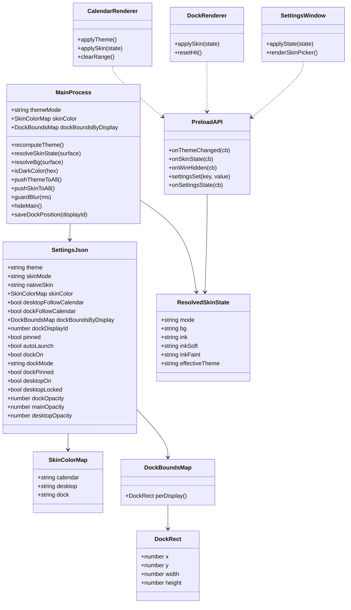
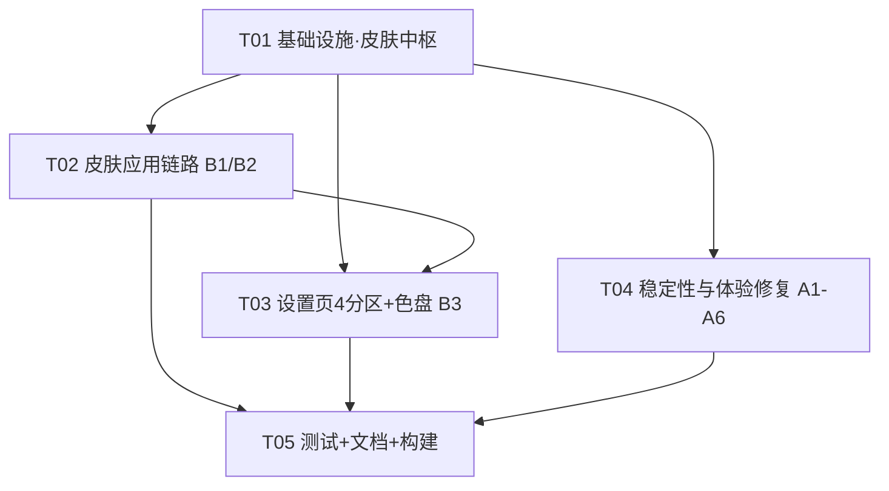

# 简洁桌面日历 · v2.4.0 第一批 · 增量设计 + 任务分解

> 文档性质：**增量设计**。在 v2.3.2 现有结构上做「6 项调整 + 4 项新增」，UI 结构与核心日历逻辑保持不变。
> 基线：v2.3.2 → 目标：v2.4.0（第一批）｜技术栈：Electron 31 + 纯 ES5，无框架、无打包器
> 读者：工程师（实现）、QA（验收）
> 配套文档：`v2.4.0-增量PRD-第一批.md`（本文所有需求编号 A1~A6 / B1~B4 / B2-img 与之一一对应）

---

## Part A：系统设计

### 1. 实现方案

#### 1.1 核心难点与方案取舍

| 难点 | 结论 / 方案 |
|---|---|
| **皮肤如何"不伤结构"落地** | 皮肤 = **独立背景层 + 自动明暗文字层**。不改 `--accent`、不改状态色（今日蓝 / 节假日红 / 选中绿）、不改 DOM。用新增 CSS 变量 `--skin-*` + `[data-skin="custom"]` 覆盖规则注入，主进程 `win.setBackgroundColor` 兜底防闪烁。 |
| **主题→皮肤的统一与解耦** | 保留现有 `themeMode`（light/dark）作为**「生效主题」**与 `theme-changed` 广播通道（复用不重造）；新增 `skinMode/nativeSkin/skinColor` 作为**「皮肤」**层。生效主题 = 原生皮肤（light/dark/system）的推导结果；自选皮肤只在生效主题之上覆盖背景层与文字明暗。 |
| **自选纯色「自动明暗」** | 主进程做唯一真相：`isDarkColor(hex)` 按 WCAG 相对亮度判定背景明暗，下发**已解析好的文字色值**（`ink/inkSoft/inkFaint` 十六进制），渲染层只 `setProperty` 应用，不各自算亮度、避免三份实现漂移。状态色（今日蓝 / 节假日红 / 选中绿）**不随背景明暗变**，继续取自生效主题 token。 |
| **A1 blur 隐藏偶发失效** | 根因：`suppressBlur` 布尔 + `setTimeout` 复位存在竞态（菜单关闭后 800ms 窗口、dock 点击的 `isFocused()` 竞态）。改为 **`blurGraceUntil` 时间戳 + `guardBlur(ms)` + `BrowserWindow.getFocusedWindow()` 判定焦点是否仍在本应用任一窗口**；`win.on('show')` 同步清 grace；隐藏统一收口到一个 `hideMain()`。 |
| **A2 range 状态残留** | 渲染层 `clearRange()` 已具备；缺的是「窗口隐藏」的可靠信号。新增 `win-hidden` IPC：主进程 `hideMain()` / `win.on('hide')` 统一下发，app.js 收到即 `clearRange()`。 |
| **A3 多屏位置记忆** | 单一 `dockBounds` 无法按屏记忆。改为 `dockBoundsByDisplay`（displayId → 矩形）+ `dockDisplayId`（上次所在屏）；`display-removed` 回落、`display-added` 还原、`display-metrics-changed` 越界夹取（既有）。 |
| **B4 实时跟随系统** | `nativeTheme.on('updated')` 在 `app.whenReady` 里注册一次；仅当 `nativeSkin==='system'` 时重算生效主题并走既有 `theme-changed` 广播（托盘/插件/桌面/关注列表/设置同步反色）。 |
| **A4 右键模糊残留** | `dock.html` 原生菜单弹出期间收不到 mousemove/mouseleave → `body.hit` 残留。在 `contextmenu` 与窗口 `blur` 时显式 `resetHit()`（`hitInside=false`、移除 `body.hit`、`dockSetMouse(true)` 恢复穿透）。 |
| **A5 时间栏拖动** | `#infoBar` 加 `-webkit-app-region: drag`（内部无可点子元素，无需 no-drag；仍遵守放大态工作区夹取由主进程 `move` 已有逻辑覆盖）。 |
| **A6 插件间距/居中** | `#dockDate` 拆「星期 + 日期」两 span，用 gap 放宽；`#card` 保持 `justify-content:center`，注意不与 `applyDockSize()` 固定像素布局冲突。 |

#### 1.2 皮肤数据模型（settings.json 增量）

```js
// userData/settings.json 新增字段（既有字段原样保留）
{
  "theme": "light",                    // 兼容旧字段，恒等于「生效主题」，继续写入
  "skinMode": "native",                // "native" 原生皮肤 | "custom" 自选皮肤
  "nativeSkin": "system",              // "light" | "dark" | "system"（system=跟随系统）
  "skinColor": {                       // 自选纯色（"#RRGGBB" | null=未设，回原生外观）
    "calendar": null,
    "desktop":  null,
    "dock":     null
  },
  "desktopFollowCalendar": true,       // 桌面插件默认跟随日历皮肤
  "dockFollowCalendar": true,          // 浮动插件默认跟随日历皮肤（决策2）
  "dockBoundsByDisplay": {             // 新增：按显示器 ID 记忆（决策：多屏各自记住）
    "2528732444": { "x": 1208, "y": 756, "width": 116, "height": 50 }
  },
  "dockDisplayId": 2528732444          // 上次所在显示器 ID（回落/还原用）
}
```

- **生效主题推导**（`recomputeTheme()`，唯一入口）：
  - `nativeSkin === 'light'` → `themeMode = 'light'`
  - `nativeSkin === 'dark'` → `themeMode = 'dark'`
  - `nativeSkin === 'system'` → `themeMode = nativeTheme.shouldUseDarkColors ? 'dark' : 'light'`
- **各表面解析背景**（`resolveBg(surface)`）：
  - `calendar` → `skinColor.calendar`
  - `desktop` → `desktopFollowCalendar ? skinColor.calendar : skinColor.desktop`
  - `dock` → `dockFollowCalendar ? skinColor.calendar : skinColor.dock`
- **表面皮肤状态**（下发渲染层）`{ mode, bg, ink, inkSoft, inkFaint, effectiveTheme }`，主进程按 surface 解析好后逐一推送。

#### 1.3 皮肤应用机制（CSS 变量注入）

主进程是唯一真相：解析好每个表面的 `bg` 与自动明暗文字色，经新 IPC `skin-state` 下发；渲染层只做变量注入：

```css
/* template.html / dock.html 各自 :root 追加 */
:root {
  --skin-bg-solid: transparent;
  --skin-ink: #1f2430;      /* 兜底，实际由 JS 覆盖 */
  --skin-ink-soft: #6b7280;
  --skin-ink-faint: #9aa1ad;
}
/* template.html（日历主窗 + 桌面插件共用） */
[data-skin="custom"] body     { background: var(--skin-bg-solid); }
[data-skin="custom"] #widget  { background: var(--skin-bg-solid); }
[data-skin="custom"] { --ink: var(--skin-ink); --ink-soft: var(--skin-ink-soft); --ink-faint: var(--skin-ink-faint); }

/* dock.html（仅覆盖卡片，窗口外透明区保持穿透，不改 body） */
[data-skin="custom"] #card { background: var(--skin-bg-solid); }
[data-skin="custom"] { --ink: var(--skin-ink); --ink-soft: var(--skin-ink-soft); }
```

- 渲染层 `applySkin(state)`：`mode==='custom' && bg` → 设 `documentElement.dataset.skin='custom'` + `setProperty` 四个变量；否则 `delete dataset.skin`（回原生）。
- `applyTheme()`（既有）仍按 `theme-changed` 设 `data-theme`，决定状态色 / 控件色 / 阴影 token。
- **自动明暗文字只覆盖 `--ink / --ink-soft / --ink-faint`**，其余语义 token（`--accent-strong` 今日蓝、`--holiday-fg`/`--cinnabar` 节假日红、`--range*` 选中绿）保持生效主题值不变。

#### 1.4 主进程 `setBackgroundColor` 兜底

- 日历主窗 / 桌面插件 / 浮动插件三个透明窗口，在自定义皮肤激活时调用 `win.setBackgroundColor(bg)`；皮肤关闭（回原生）时恢复 `'#00000000'`。用于加载首帧 / 圆角透明区的底色一致，视觉不闪；核心视觉仍由渲染层 `#widget/#card` 背景决定（保持圆角/透明穿透语义不变）。

---

### 2. 文件清单

> 本批**不新增文件**（皮肤逻辑并入现有单文件主进程，沿用项目「纯 ES5 单文件 + 运行时抽函数单测」范式；避免无谓抽象）。

**修改文件（相对项目根 `D:\AI\简洁日历`）：**

| 文件 | 改动点 |
|---|---|
| `electron-main.js` | settings 新字段 load/save/snapshot；`recomputeTheme()`/`resolveSkinState()`/`isDarkColor()`/`pushSkinToXxx()`；`nativeTheme.on('updated')`；A1 blur 重构 + `hideMain()` + `win-hidden` 下发；A3 `dockBoundsByDisplay` + display-added/removed；`setBackgroundColor`；`settings-set` 新 key 分支；`set-theme` 映射 nativeSkin |
| `preload.js` | 新增 `onSkinState` / `onWinHidden` 桥 |
| `app.js` | 新增 `applySkin()` + 订阅 `onSkinState`；`onWinHidden`→`clearRange()`；`applyTheme()` 与皮肤解耦；themeBtn 快捷切换语义适配 |
| `template.html` | 新增 `--skin-*` 变量与 `[data-skin="custom"]` 规则；A5 `#infoBar` 加 `-webkit-app-region: drag` |
| `dock.html` | 新增 `--skin-*` 变量与 `[data-skin="custom"] #card` 规则；订阅 `onSkinState`；A4 `resetHit()`；A6 日期拆 span + 间距/居中 |
| `settings.html` | 重排 4 分区；皮肤选择器（类型 seg + 原生三选 seg + 三表面色卡 + 预设色板 + `<input type="color">` + 跟随开关 + 图片占位 + 重置）；脚本新增皮肤控件回写与灰显 |
| `package.json` | `version` → `2.4.0` |
| `verify_v1721.js` | 版本断言 → 2.4.0；新增皮肤 / 多屏 / blur / range / 拖动 静态断言 |
| `smoke-test.js` | mock 扩展（`screen.getDisplayMatching/getAllDisplays`、`nativeTheme.on`、`setBackgroundColor`、`getFocusedWindow`）；跑皮肤 + 多屏冒烟 |
| `runtime-test_v1721.js` | 新增 `isDarkColor`/`resolveBg`/dock 显示 keying 等运行时单测（`extractFn` 抽真实函数） |
| `PROGRAM_SPEC.md` | 头版本 1.7.22 → 2.4.0 + 皮肤章节刷新（决策6） |
| `CHANGELOG.md` | 新增 `[2.4.0]` 条目 |

---

### 3. 数据结构与接口

#### 3.1 类图（数据模型 + 关键模块）



#### 3.2 IPC 通道（新增 / 变更）

| 通道 | 方向 | 说明 |
|---|---|---|
| `theme-changed` | 主→渲染 | **既有复用**，载荷 `effectiveTheme`（light/dark），驱动 `data-theme` |
| `skin-state` | 主→渲染 | **新增**，载荷 `ResolvedSkinState`（按 surface 解析），驱动 `data-skin` + `--skin-*` 变量 |
| `win-hidden` | 主→日历渲染 | **新增**，无载荷；app.js 收到即 `clearRange()` |
| `settings-set` | 渲染→主 | **扩展 key**：`skinMode` / `nativeSkin` / `skinColor`（值 `{surface, hex}`）/ `desktopFollowCalendar` / `dockFollowCalendar` / `skinReset`（值=surface） |
| `set-theme` | 渲染→主 | **语义变更**：主窗 themeBtn 快捷切换映射为 `nativeSkin`（light↔dark），不改变 `skinMode` |
| `settings-state` | 主→渲染 | **扩展载荷**：`settingsSnapshot()` 增加皮肤字段与各表面 resolved bg |

#### 3.3 CSS 变量注入约定（模板层）

见 §1.3；变量命名收敛为 4 个：`--skin-bg-solid`、`--skin-ink`、`--skin-ink-soft`、`--skin-ink-faint`。

---

### 4. 程序调用流程

```mermaid
sequenceDiagram
    autonumber
    participant SET as settings.html
    participant M as electron-main.js
    participant CAL as calendar.html(app.js)
    participant DOCK as dock.html
    participant OS as 系统(nativeTheme/screen)

    Note over M: 启动 init（whenReady）
    M->>M: loadSettings() 读 skinMode/nativeSkin/skinColor/dockBoundsByDisplay
    M->>M: recomputeTheme() 推导生效主题
    M->>M: createWindow/createDock/createDesktopWidget
    M-->>CAL: theme-changed(light|dark)
    M-->>CAL: skin-state(ResolvedSkinState)
    M-->>DOCK: theme-changed + skin-state
    M->>OS: nativeTheme.on('updated') 注册一次

    Note over SET,M: 皮肤应用（B1/B2/B3）
    SET->>M: settings-set('skinMode','custom')
    SET->>M: settings-set('skinColor',{surface:'calendar',hex:'#123456'})
    M->>M: skinColor 更新 → resolveBg()/resolveSkinState()
    M->>M: win.setBackgroundColor(hex)
    M-->>CAL: skin-state({mode:'custom',bg:'#123456',ink:'#e8eaf0',...})
    CAL->>CAL: applySkin() 设 data-skin=custom + setProperty(--skin-*)
    M-->>DOCK: skin-state(...)  // dockFollowCalendar=true → 跟随日历 bg
    DOCK->>DOCK: applySkin()
    M->>M: saveSettings() + pushSettingsState()

    Note over OS,M: 跟随系统实时深浅色（B4）
    OS->>M: nativeTheme updated（系统切换深浅）
    M->>M: nativeSkin==='system'? → recomputeTheme()
    M-->>CAL: theme-changed(newTheme)
    M-->>DOCK: theme-changed(newTheme)
    M->>M: tray.setImage + pushSettingsState()

    Note over DOCK,M: A3 多屏位置记忆
    DOCK->>M: dock-drag-end（松手）
    M->>M: id=screen.getDisplayMatching(rect).id
    M->>M: dockBoundsByDisplay[id]=rect; dockDisplayId=id; saveSettings()
    OS->>M: display-removed（外接屏断开）
    M->>M: clampDockToWorkArea 回落到存活工作区
    OS->>M: display-added（重新连接）
    M->>M: 若 dockBoundsByDisplay[newId] 存在 → 还原到原屏原位

    Note over M,CAL: A1/A2 blur 隐藏 + range 重置
    CAL->>M: （用户点击日历窗口外部）
    M->>M: win.on('blur')：Date.now()<blurGraceUntil? 或焦点仍在 app 内? → 跳过
    M->>M: hideMain()：win.hide()
    M-->>CAL: win-hidden
    CAL->>CAL: clearRange()（清 rangeSel + 隐藏天数浮层 + 重绘）
```

---

### 5. Anything UNCLEAR（待明确事项）

1. **主窗右上角 themeBtn 的最终语义**：本设计建议保留为「原生皮肤 light↔dark 快捷切换」（`set-theme` → `nativeSkin`），`skinMode` 不变、`system` 态下点击切到与当前生效主题相反的手动项。若产品希望改为「点开设置」，需另行确认（当前按「保留快捷切换」设计）。
2. **「皮肤弹窗」形态**：PRD §5.2 用「展开色盘」，决策5 定义为「预设色板 + 原生取色器」。本设计按**设置页内联展开面板**实现（不新增独立窗口）；若要求独立弹窗，需另评估窗口管理成本。
3. **`system` 态在自定义皮肤下的状态色来源**：本设计按 PRD §7 Q3 建议——`nativeSkin` 仍决定「状态色 token 来源 + 辅助窗口（设置/关注列表/提醒弹窗）主题」，自定义纯色仅覆盖背景层 + 文字自动明暗。
4. **旧 `theme` 字段兼容策略**：保留写入（=生效主题镜像），保证旧版 / 第三方面板读 settings.json 不崩；若确定无兼容诉求，可移除。
5. **`dockDisplayId` 的持久化 key 值**：Electron display.id 在不同机器/会话可能变化，需以「当前运行时 ID 表」为准；换机后若 ID 不存在，回落主屏默认落点（本设计已按此处理）。

---

## Part B：任务分解

### 6. 依赖包列表

**无需新增任何第三方包。** 全部能力来自 Electron 31 内置：
- `nativeTheme`（实时深浅色）、`screen`（display 事件）、`BrowserWindow.setBackgroundColor/getFocusedWindow`（已内置）
- `<input type="color">`（原生取色器，零依赖、ES5 兼容）
- 现有 `electron` + `electron-builder` 不变。

### 7. 任务列表（有序，按实现顺序）

| 任务 | 名称 | 涉及文件 | 依赖 | 优先级 | 验收要点 |
|---|---|---|---|---|---|
| **T01** | 基础设施：版本升级 + 皮肤数据模型 + 主题/皮肤中枢 | `package.json`、`electron-main.js`、`preload.js`、`verify_v1721.js` | 无 | P0 | ① `package.json` 2.4.0、`verify` 版本断言通过；② `loadSettings/saveSettings/settingsSnapshot` 支持新字段且旧字段回退不崩；③ `recomputeTheme()/resolveBg()/isDarkColor()/pushSkinToAll()` 就位；④ `nativeTheme.on('updated')` 注册且 mock 冒烟不炸；⑤ `preload` 暴露 `onSkinState/onWinHidden` |
| **T02** | 皮肤应用链路：三表面背景 + 自动明暗落地（B1/B2） | `template.html`、`app.js`、`dock.html`、`electron-main.js` | T01 | P0 | ① 自选纯色下日历/桌面/浮动背景即时变化；② 文字自动明暗、状态色（今日蓝/节假日红/选中绿）不变；③ 桌面/浮动默认跟随日历，关闭跟随可独立设色；④ 回原生皮肤恢复原外观；⑤ 迷你与放大（同一窗口）背景一致 |
| **T03** | 设置页 4 分区重排 + 皮肤选择器 UI（B3 + 色盘） | `settings.html`、`electron-main.js` | T01、T02 | P0 | ① 四分区「功能区/桌面插件区/浮动插件区/日历窗口区」归类正确无遗漏；② 皮肤类型 seg + 原生三选 seg + 三表面色卡 + 预设色板 + `<input type="color">` + 跟随开关 + 图片占位灰显；③ 选色即时生效并持久化；④ 深色下控件/分区样式正常 |
| **T04** | 稳定性与体验修复（A1/A2/A3/A4/A5/A6） | `electron-main.js`、`app.js`、`dock.html`、`template.html`、`preload.js` | T01 | P0/P1 | ① A1 点外部 20 连击全隐藏、无 `suppressBlur` 卡死日志；② A2 隐藏后重开无绿格/无天数浮层；③ A3 多屏各自记忆、断连回落、重连还原、重启保持；④ A4 右键取消即恢复无残留模糊；⑤ A5 mini/放大顶部时间栏可拖动；⑥ A6 星期/日期间距放宽且垂直居中 |
| **T05** | 测试补全 + 文档刷新 + 构建校验 | `verify_v1721.js`、`smoke-test.js`、`runtime-test_v1721.js`、`PROGRAM_SPEC.md`、`CHANGELOG.md` | T01~T04 | P0/P2 | ① `npm run check` 三套测试全绿；② `npm run build`（含 prebuild）成功；③ `PROGRAM_SPEC.md` 头版本 2.4.0 + 皮肤章节同步；④ `CHANGELOG.md` 新增 2.4.0 条目 |

### 8. 共享知识（跨文件约定）

- **皮肤枚举**：`skinMode ∈ {native, custom}`；`nativeSkin ∈ {light, dark, system}`；`surface ∈ {calendar, desktop, dock}`；`skinColor[surface]` 为 `"#RRGGBB"` 或 `null`。
- **生效主题**：`themeMode ∈ {light, dark}`，恒由 `recomputeTheme()` 推导，是 `theme-changed` 的唯一载荷，也是托盘图标 / 设置页 / 关注列表 / 提醒弹窗 / 退出弹窗的主题来源。
- **CSS 皮肤变量（唯一真源）**：`--skin-bg-solid`、`--skin-ink`、`--skin-ink-soft`、`--skin-ink-faint`；仅在 `[data-skin="custom"]` 下生效；`--ink/--ink-soft/--ink-faint` 被其覆盖，状态色与 `--accent` 不覆盖。
- **自动明暗文字色值表**（主进程 `isDarkColor` 判定后下发，渲染层不重复实现）：
  - 浅背景（深字）：ink `#1f2430` / ink-soft `#6b7280` / ink-faint `#9aa1ad`
  - 深背景（浅字）：ink `#e8eaf0` / ink-soft `#9aa3b3` / ink-faint `#6a7283`
- **明暗判定**：`isDarkColor('#RRGGBB')` = 相对亮度（WCAG）< 0.5 视为深色背景 → 浅字。
- **窗口背景兜底**：自选皮肤激活 → `win.setBackgroundColor(bg)`；回原生 → `'#00000000'`。仅兜底，视觉真源是 `#widget/#card` 背景。
- **设置回写范式**：延续「无保存按钮、主进程唯一真相」，所有皮肤/开关/滑杆走 `settings-set`，主进程处理后 `pushSettingsState()` 回推。
- **blur 保护**：用 `blurGraceUntil` 时间戳 + `guardBlur(ms)`，不再用裸布尔 + 多处 setTimeout；隐藏统一走 `hideMain()`（内含 `win-hidden` 下发）。
- **dock 定位**：继续沿用 `dockW/dockH` 意图尺寸 + `dockClamped()` 唯一入口；新增「按 displayId 记忆」不改动意图尺寸语义。
- **主进程是唯一真相**：亮度判定、背景解析、状态色来源全部在主进程算好，渲染层只应用变量，杜绝多端各自实现导致漂移。

### 9. 任务依赖图



---

*架构师：高见远 ｜ 输出日期：与 PRD 同批 ｜ 状态：待工程师实现*
