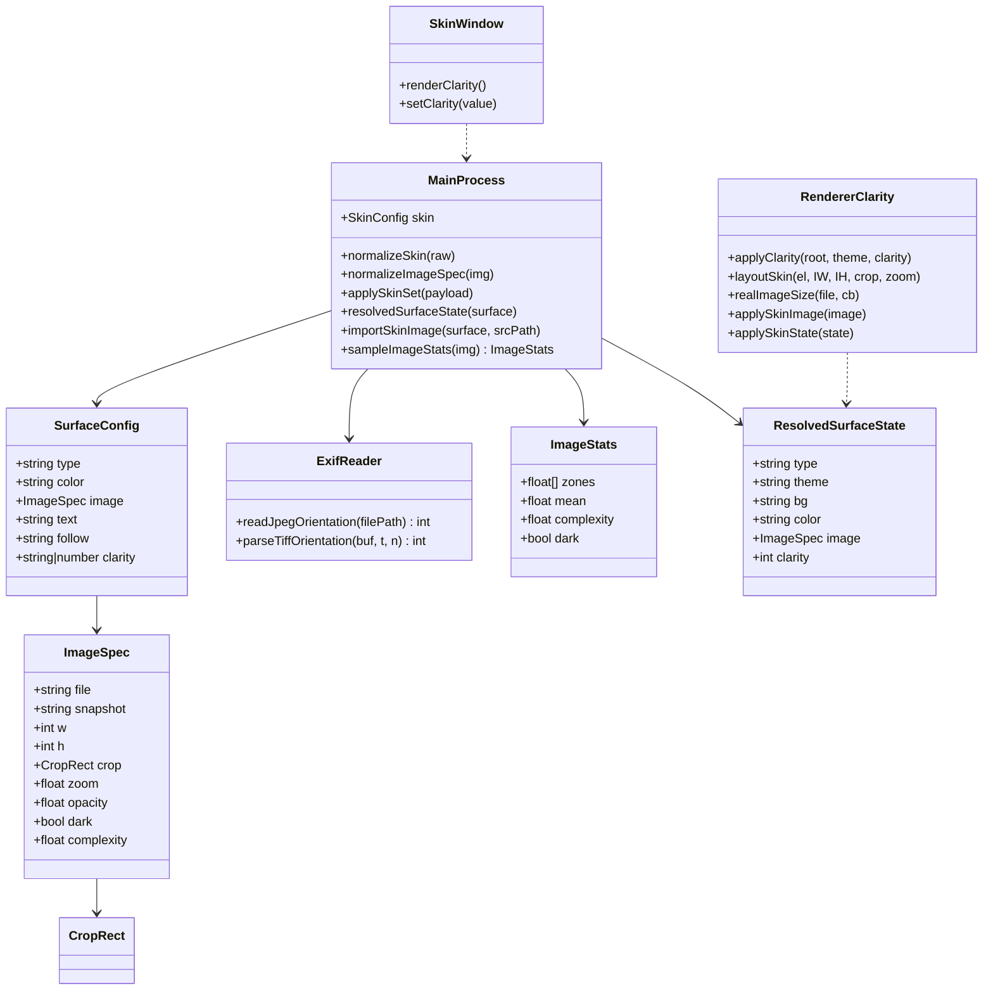
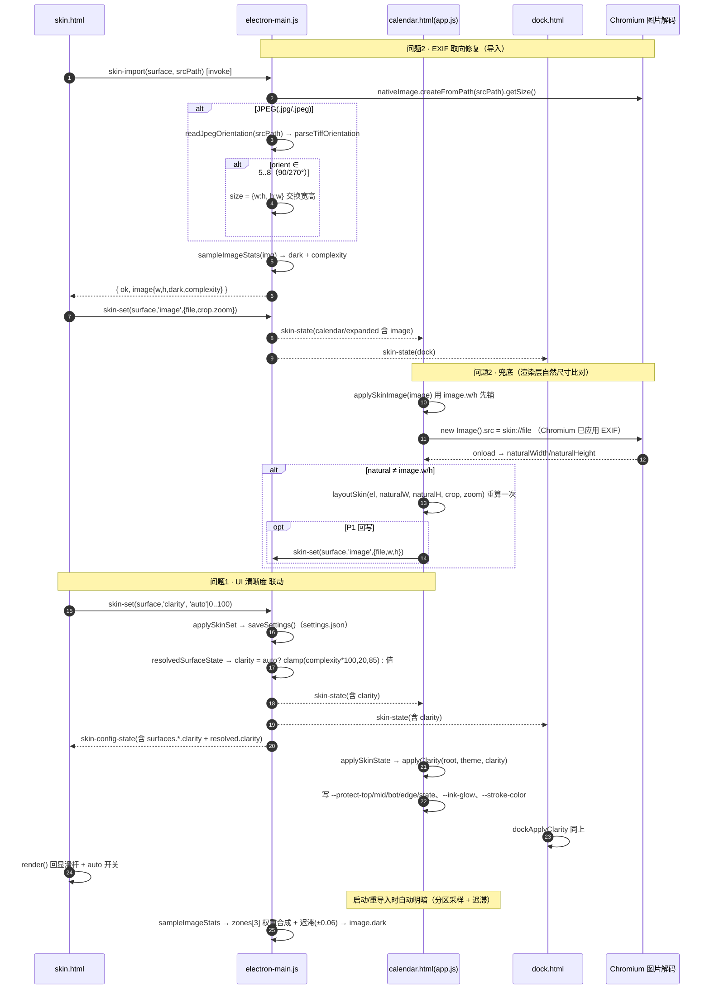

# 简洁桌面日历 · v2.4.0 第三轮 · 图片取景修复 + 可读性三层结构 · 增量设计 + 任务分解

> 文档性质：**第三轮增量设计**。承接第二轮（per-surface 皮肤 + 图片皮肤），本轮做 **两个整改点**：
> ① **竖拍图片被上下压扁**（EXIF 取向错配，明确 bug）；② **自选背景图片可读性**（三层结构 + UI 清晰度滑杆）。
> 基线：已实现第二轮 HEAD（`skin.html`/`skin://`/per-surface 均落地）｜技术栈：Electron 31 + 纯 ES5，无框架、无打包器
> 读者：工程师（实现）、QA（验收）｜配套源码：`electron-main.js` / `app.js` / `template.html` / `dock.html` / `skin.html` / `settings.html` / `preload.js`
> 目标版本：**v2.4.4**（与代码内既有 `v2.4.2`/`v2.4.3` 注释递进；若团队统一为「v2.4.0 第三轮」交付则保持 v2.4.0）

---

## Part A：系统设计

### 1. 实现方案（难点取舍）

| 难点 | 结论 / 方案 |
|---|---|
| **竖拍图压扁（根因）** | `importSkinImage()` 用 `nativeImage.createFromPath().getSize()` 读到的是**未应用 EXIF 旋转的物理尺寸**（横向），写入 `image.w/h`；而 Chromium 渲染 `background-image` 时**自动应用 EXIF 旋转**（显示为竖向）。取景基准 `s0 = max(vp.w/IW, vp.h/IH)` 因此横竖倒置 → 横向拉伸、纵向压扁。 |
| **主方案：EXIF 取向解析** | 导入 JPEG（`.jpg/.jpeg`）时**只读文件头 APP1 段**解析 EXIF `Orientation`（纯本地、毫秒级、无依赖）。若值 ∈ **5~8**（含 90°/270° 旋转）→ **交换记录宽高**，使软件记录尺寸与 Chromium 实际渲染一致；`1~4`（含 180°/镜像，尺寸不变）或缺失 → 不动。 |
| **其它格式策略** | **PNG / GIF**：Chromium 不应用 EXIF 旋转，`Orientation` 恒按 1 处理（跳过解析）。**WebP**：含 EXIF 时 Chromium 可能旋转，采用**兜底方案 B**（渲染层自然尺寸比对）兜住，不做 WebP EXIF 解析（避免过度工程）。 |
| **兜底方案：渲染层自然尺寸比对** | `app.js applySkinImage()` 加载后用 `HTMLImageElement.naturalWidth/naturalHeight`（Chromium **已应用 EXIF**）与 `image.w/h` 比对，不一致则以真实尺寸重算取景；用文件名缓存真实尺寸，避免重复异步加载与闪烁。覆盖 WebP / 老数据 / 解析失败场景。 |
| **可读性第 1 层：自动明暗更聪明** | 现有「整图 64px 均值 `lum<0.5`」扛不住局部亮暗不均。改为**上/中/下三区采样** + **权重合成** + **迟滞阈值防抖**（±0.06），输出 `dark` 与 `complexity`（0~1 局部亮度方差）。 |
| **可读性第 2 层：局部背景保护层（核心）** | **不再给整图调透明度**（会整体发灰、且挡不住局部）。改为在 **UI 元素处加极淡半透明保护**：顶部信息栏 `#infoBar`、日历网格 `#calendar`、底部工具栏 `#dragBar` 各加一层**主题向**遮罩（浅底主题→白光罩，深底主题→黑影罩），强度按 `complexity` 自适应。 |
| **可读性第 3 层：轻光晕替代重描边** | 现为 `-webkit-text-stroke: 0.5px`（居中真描边）。改为**描边减淡 + 加一层 `--ink-glow` 柔和光晕**（`text-shadow`），并给 今日蓝/节假日红/选中绿/区间 等状态元素加**轻微保护晕环**（`::after` 外环，不破坏原状态底色）。 |
| **UI 清晰度滑杆（一个值联动多参数）** | `skin.html` 新增「UI 清晰度」0~100 滑杆 + 「自动」开关（默认自动）。一个 `clarity` 值**线性联动**：文字光晕模糊/浓度、三层保护层浓度、单元格/信息条描边不透明度、状态元素晕环浓度。`auto` → 由 `complexity` 推导。 |
| **数据模型扩展（纯增量）** | `skin.surfaces[x]` 增 `clarity`（`'auto'|0~100`）；`image` 增 `complexity`（0~1，导入缓存）。**字段纯增量、向后兼容 → 不需要 `__v` 升级，保持 `__v:2`**；`normalizeSkin` 缺省补 `clarity:'auto'`，老 settings.json 自动补全。 |

**取舍说明**：① EXIF 解析只做 JPEG（覆盖 99% 手机竖拍场景），其余靠兜底，避免 WebP/TIFF 解析的过大投入；② 保护层放在**主进程采样、渲染层算色**，保持「主进程唯一真相」；③ `clarity` 用 `'auto'|number` 混合类型，与既有 `text:'auto'` 一致，不引入新枚举。

---

### 2. 问题 2：EXIF 取向修复（明确 bug）

#### 2.1 现状（只读确认）

| 位置 | 代码 | 问题 |
|---|---|---|
| `electron-main.js` `importSkinImage()` L476-479 | `img = nativeImage.createFromPath(srcPath); size = img.getSize();` | 读物理尺寸，无 EXIF 旋转 |
| `electron-main.js` L517-526 | `image = { file, snapshot, w: size.width, h: size.height, … }` | 落盘横竖相反的 w/h |
| `app.js` `applySkinImage()` L690-700 | `IW=image.w, IH=image.h; s0=max(vp.w/IW, vp.h/IH)` | 用错尺寸算 cover 基准 → 压扁 |

#### 2.2 主方案（A）：主进程解析 JPEG EXIF Orientation

**新增函数**（`electron-main.js`，置于 `readGifSize` 之后）：

```js
/* v2.4.4：读取 JPEG 文件头 APP1 段 EXIF Orientation（1~8）。
 * 只读前 64KB（EXIF 段通常在头部），纯本地计算、毫秒级、零依赖。
 * 返回 1..8；非 JPEG / 无 EXIF / 解析失败 → 1（不旋转）。 */
function readJpegOrientation(filePath) {
  try {
    var fd = fs.openSync(filePath, 'r');
    try {
      var buf = Buffer.alloc(65536);
      var n = fs.readSync(fd, buf, 0, 65536, 0);
      // 1) SOI：FF D8
      if (n < 4 || buf[0] !== 0xFF || buf[1] !== 0xD8) return 1;
      var off = 2;
      // 2) 逐段扫描找 APP1（FF E1）
      while (off + 4 <= n) {
        if (buf[off] !== 0xFF) { off++; continue; }
        var marker = buf[off + 1];
        if (marker === 0xD8 || marker === 0x01 || (marker >= 0xD0 && marker <= 0xD7)) { off += 2; continue; }
        if (marker === 0xDA || marker === 0xD9) break;              // SOS/EOI：不再有 EXIF
        var segLen = buf.readUInt16BE(off + 2);
        if (segLen < 2) break;
        if (marker === 0xE1) {                                       // APP1
          var p = off + 4;
          if (p + 6 <= n && buf.toString('ascii', p, p + 6) === 'Exif\u0000\u0000') {
            return parseTiffOrientation(buf, p + 6, n);              // TIFF header 起点
          }
        }
        off += 2 + segLen;
      }
      return 1;
    } finally { fs.closeSync(fd); }
  } catch (e) { return 1; }
}

/* TIFF header → IFD0 → 找 tag 0x0112(Orientation) 的 16-bit 值 */
function parseTiffOrientation(buf, t, n) {
  try {
    if (t + 8 > n) return 1;
    var le;                                                          // 小端？
    if (buf[t] === 0x49 && buf[t + 1] === 0x49) le = true;           // 'II'
    else if (buf[t] === 0x4D && buf[t + 1] === 0x4D) le = false;     // 'MM'
    else return 1;
    var magic = le ? buf.readUInt16LE(t + 2) : buf.readUInt16BE(t + 2);
    if (magic !== 0x002A) return 1;
    var ifdOff = (le ? buf.readUInt32LE(t + 4) : buf.readUInt32BE(t + 4)) + t;
    if (ifdOff + 2 > n) return 1;
    var count = le ? buf.readUInt16LE(ifdOff) : buf.readUInt16BE(ifdOff);
    var e = ifdOff + 2;
    for (var i = 0; i < count && e + 12 <= n; i++, e += 12) {
      var tag = le ? buf.readUInt16LE(e) : buf.readUInt16BE(e);
      if (tag === 0x0112) {                                          // Orientation
        var val = le ? buf.readUInt16LE(e + 8) : buf.readUInt16BE(e + 8);
        return (val >= 1 && val <= 8) ? val : 1;
      }
    }
    return 1;
  } catch (e) { return 1; }
}
```

**接入点**（`importSkinImage()`，L476-479 之后、L517 写 `image` 之前）：

```js
if (!isGif) {
  img = nativeImage.createFromPath(srcPath);
  if (!img || img.isEmpty()) return { ok: false, error: '图片解码失败' };
  size = img.getSize();
  // v2.4.4：JPEG 竖拍/旋转修正 —— EXIF 5~8 含 90°/270°，交换宽高使记录尺寸=Chromium 渲染尺寸
  if (ext === '.jpg' || ext === '.jpeg') {
    var orient = readJpegOrientation(srcPath);
    if (orient >= 5 && orient <= 8) size = { width: size.height, height: size.width };
  }
}
```

**异常兜底**：`readJpegOrientation` 内所有异常 → 返回 1（不动），导入流程不因解析失败而中断；解析失败时由兜底方案 B 在渲染层纠正。

#### 2.3 兜底方案（B）：渲染层自然尺寸比对

**接入点**：`app.js applySkinImage()` 与 `dock.html dockApplyImage()`。

```js
// 模块级缓存：file -> { w, h }（Chromium 已应用 EXIF 的真实显示尺寸）
var imgRealSize = {};
var imgProbing = {};

function realImageSize(file, cb) {
  if (imgRealSize[file]) { cb(imgRealSize[file]); return; }
  if (imgProbing[file]) { imgProbing[file].push(cb); return; }
  imgProbing[file] = [cb];
  var probe = new Image();
  probe.onload = function () {
    var sz = { w: probe.naturalWidth || 0, h: probe.naturalHeight || 0 };
    imgRealSize[file] = sz;
    var list = imgProbing[file]; delete imgProbing[file];
    for (var i = 0; i < list.length; i++) { try { list[i](sz); } catch (e) {} }
  };
  probe.onerror = function () {
    var list = imgProbing[file]; delete imgProbing[file];
    for (var i = 0; i < list.length; i++) { try { list[i](null); } catch (e) {} }
  };
  probe.src = 'skin://' + encodeURIComponent(file);
}
```

在 `applySkinImage(image)` 中：**先用 `image.w/h` 立即布局**（防空白）→ 再异步探测；若 `(nat.w,nat.h)` 与 `(IW,IH)` 不一致 → 以真实尺寸重算一次取景：

```js
function applySkinImage(image) {
  var el = document.getElementById('skinImg');
  if (!el) return;
  if (!image || !image.file) { /* clear */ return; }
  var file = (skinHidden && image.snapshot) ? image.snapshot : image.file;
  el.style.backgroundImage = 'url("skin://' + encodeURIComponent(file) + '")';
  el.style.opacity = (typeof image.opacity === 'number' && isFinite(image.opacity)) ? String(image.opacity) : '1';
  layoutSkin(el, image.w, image.h, image.crop, image.zoom);        // 用已知尺寸先铺
  realImageSize(file, function (sz) {                              // 异步纠偏
    if (!sz || !sz.w || !sz.h) return;
    var IW = (image.w > 0) ? image.w : sz.w, IH = (image.h > 0) ? image.h : sz.h;
    if (sz.w !== IW || sz.h !== IH) layoutSkin(el, sz.w, sz.h, image.crop, image.zoom);
  });
}
```

**避免闪烁 / 重复布局**：
- 仅在**尺寸不一致**时才重排一次（正常 JPEG 主方案已修正 → 不触发）；缓存后同文件不再探测。
- `layoutSkin` 为纯函数（把现有 `s0/s/background-size/position` 计算抽出来），两处复用。
- 若当前背景已被替换（`el.style.backgroundImage` 不再指向该 file）→ 探测回调里跳过（用闭包捕获的 `file` 与当前比对）。

**GIF 处理**：GIF 无 EXIF，`naturalWidth/naturalHeight` = 原始尺寸，与 `readGifSize` 一致 → 不触发重排；冻结帧 `snapshot` 与动图 `file` **分别缓存**（键即文件名，天然区分）。

**可选（P1）回写**：纠偏成功后 `window.api.skinSet(surface,'image',{file,w:sz.w,h:sz.h})` 回写主进程持久化，避免每次启动重探。第一版可不做（探测成本极低）。

---

### 3. 问题 1：可读性三层结构

#### 3.1 第 1 层 — 自动明暗更聪明（分区采样 + 迟滞）

**采样**（主进程，复用现有 64px 缩略图 `toBitmap()` 循环）：把缩略图按**行**分上/中/下三区，跳过透明像素（沿用 L499 规则），分别算累计 RGB。

```js
function sampleImageStats(img) {
  var thumb = img.resize({ width: 64 });
  var bmp = thumb.toBitmap();                 // BGRA
  var H = thumb.getSize().height || 1;
  var zoneSum = [ {r:0,g:0,b:0,n:0}, {r:0,g:0,b:0,n:0}, {r:0,g:0,b:0,n:0} ]; // 上/中/下
  var lumSq = 0, lumSum = 0, cnt = 0;
  for (var i = 0; i < bmp.length; i += 4) {
    if (bmp[i + 3] === 0) continue;           // 透明像素不计
    var px = (i / 4) % 64, py = Math.floor((i / 4) / 64);
    var zi = (py < H / 3) ? 0 : (py < 2 * H / 3 ? 1 : 2);
    var z = zoneSum[zi]; z.b += bmp[i]; z.g += bmp[i+1]; z.r += bmp[i+2]; z.n++;
    // 逐像素相对亮度（线性加权近似）用于方差
    var l = (0.2126 * bmp[i+2] + 0.7152 * bmp[i+1] + 0.0722 * bmp[i]) / 255;
    lumSum += l; lumSq += l * l; cnt++;
  }
  var zoneY = [0, 0, 0];
  for (var k = 0; k < 3; k++) {
    var zz = zoneSum[k];
    if (zz.n > 0) zoneY[k] = wcagLum(zz.r / zz.n / 255, zz.g / zz.n / 255, zz.b / zz.n / 255);
  }
  var mean = cnt > 0 ? lumSum / cnt : 0;
  var variance = cnt > 0 ? Math.max(0, lumSq / cnt - mean * mean) : 0;
  var std = Math.sqrt(variance);                            // 局部亮度标准差
  return {
    zones: zoneY,
    mean: mean,
    complexity: Math.max(0, Math.min(1, std / 0.30))        // 0~1，0.30 为满量程常数（可调）
  };
}
```

**综合明暗判定（权重 + 迟滞）**：

```
L = 0.25*Ytop + 0.55*Ymid + 0.20*Ybot          // 中部（日期网格）权重最高
dark = decide(L, prevDark)                     // 迟滞：
   保持 dark 直到 L > 0.56；保持 light 直到 L < 0.44   （带宽 ±0.06 防抖）
```

`prevDark` 取旧 `image.dark`（重导入/重采样时传入）。输出字段：`image.dark`（综合）、`image.complexity`（0~1）。

#### 3.2 第 2 层 — 局部背景保护层（核心）

**不调整图透明度**，改在 UI 元素处叠**主题向遮罩**。保护色 = 主题基色：深底（浅字）→ 黑，浅底（深字）→ 白。浓度由 `clarity`（0~100）线性映射。

**渲染层 `applyClarity(root, theme, clarity)`**（`app.js` / `dock.html` 各一份），`p = clarity/100`，`rgb = (theme==='dark') ? '0,0,0' : '255,255,255'`：

| CSS 变量 | 用途（挂载选择器） | 公式（alpha） |
|---|---|---|
| `--protect-top` | `#infoBar` 顶部信息栏遮罩 | `0.06 + 0.30p` |
| `--protect-mid` | `#calendar::before` 日历网格遮罩 | `0.03 + 0.20p` |
| `--protect-bot` | `#dragBar` 底部工具栏遮罩 | `0.06 + 0.26p` |
| `--protect-edge` | 单元格/信息条描边 | `0.10 + 0.22p` |
| `--protect-state` | 状态元素晕环（今日/节假日/选中/区间） | `0.15 + 0.35p` |
| `--ink-glow` | 文字光晕 `text-shadow` | blur `1+3p`px, alpha `0.35+0.35p` |
| `--stroke-color` | 保留极细描边（兜底） | `0.55-0.25p`（dark）/`0.70-0.30p`（light） |

```js
function applyClarity(root, theme, clarity) {
  if (!root) return;
  var p = Math.max(0, Math.min(1, (clarity || 0) / 100));
  var ink = (theme === 'dark') ? '0,0,0' : '255,255,255';
  function a(base, k) { return (base + k * p).toFixed(3); }
  root.style.setProperty('--protect-top',   'rgba(' + ink + ',' + a(0.06, 0.30) + ')');
  root.style.setProperty('--protect-mid',   'rgba(' + ink + ',' + a(0.03, 0.20) + ')');
  root.style.setProperty('--protect-bot',   'rgba(' + ink + ',' + a(0.06, 0.26) + ')');
  root.style.setProperty('--protect-edge',  'rgba(' + ink + ',' + a(0.10, 0.22) + ')');
  root.style.setProperty('--protect-state', 'rgba(' + ink + ',' + a(0.15, 0.35) + ')');
  root.style.setProperty('--ink-glow', '0 0 ' + (1 + 3 * p).toFixed(1) + 'px rgba(' + ink + ',' + a(0.35, 0.35) + ')');
  var sa = (theme === 'dark') ? (0.55 - 0.25 * p) : (0.70 - 0.30 * p);
  root.style.setProperty('--stroke-color', 'rgba(' + ink + ',' + sa.toFixed(3) + ')');
}
```

**`clarity` 取值（主进程 `resolvedSurfaceState`）**：
```
clarity = (surfaceConfig.clarity === 'auto')
  ? (type === 'image' ? clamp(round(complexity*100), 20, 85) : 0)   // 纯色/原生 → 0
  : surfaceConfig.clarity;                                          // 手动值
```
（image 自动档设 20 下限，保证总有基础保护；纯色图均匀 → 0，不引入多余灰罩。）

**挂载选择器（`template.html`，日历 + 桌面插件共用）**：

```css
[data-skin="color"] #infoBar, [data-skin="image"] #infoBar {
  background: linear-gradient(180deg, var(--protect-top), transparent 92%);
}
[data-skin="color"] #calendar::before, [data-skin="image"] #calendar::before {
  content: ''; position: absolute; inset: 0; z-index: 1;
  background: var(--protect-mid); pointer-events: none;
}
[data-skin="color"] #dragBar, [data-skin="image"] #dragBar {
  background: var(--protect-bot);
}
```

**`dock.html`**：`[data-skin="image"] #card { background: var(--protect-mid); }`（原为 transparent）+ 文字 `--ink-glow`。

#### 3.3 第 3 层 — 轻光晕替代重描边 + 状态元素保护晕环

**描边减淡 + 光晕加广**（`template.html` 扩展现有 270-288 规则）：保留 `-webkit-text-stroke: 0.5px var(--stroke-color)`（已随 `--stroke-color` 变淡），**再对同一选择器集追加**：

```css
[data-skin="color"] #clkTime, [data-skin="image"] #clkTime,
[data-skin="color"] #infoDate, [data-skin="image"] #infoDate,
[data-skin="color"] #infoLunar, [data-skin="image"] #infoLunar,
[data-skin="color"] .sel, [data-skin="image"] .sel,
[data-skin="color"] .nav-btn, [data-skin="image"] .nav-btn,
[data-skin="color"] .today-btn, [data-skin="image"] .today-btn,
[data-skin="color"] .wk-label, [data-skin="image"] .wk-label,
[data-skin="color"] .zoom-btn, [data-skin="image"] .zoom-btn,
[data-skin="color"] #weekHeader .wcell, [data-skin="image"] #weekHeader .wcell,
[data-skin="color"] .cell .d, [data-skin="image"] .cell .d,
[data-skin="color"] .cell .sub, [data-skin="image"] .cell .sub {
  text-shadow: var(--ink-glow);
}
```

**状态元素轻微保护底（晕环，不破坏原状态底色）**：

```css
[data-skin="color"] .cell.today:not(.other)::after,
[data-skin="image"] .cell.today:not(.other)::after,
[data-skin="color"] .cell.holiday::after,   [data-skin="image"] .cell.holiday::after,
[data-skin="color"] .cell.selected:not(.other)::after,
[data-skin="image"] .cell.selected:not(.other)::after,
[data-skin="color"] .cell.range::after,     [data-skin="image"] .cell.range::after,
[data-skin="color"] .cell.reminder::after,  [data-skin="image"] .cell.reminder::after {
  content: ''; position: absolute; inset: -1px; border-radius: inherit;
  box-shadow: 0 0 0 2px var(--protect-state), 0 1px 6px var(--protect-state);
  pointer-events: none;
}
```

`dock.html` 文字集（`#dockTime/#dockWeek/#dockDateNum`）同样追加 `text-shadow: var(--ink-glow)`。

#### 3.4 UI 清晰度滑杆（`skin.html`）

- 新增分块 `#claritySection`（与 `textSection` 同步显隐：仅 `color`/`image` 显示）。
- 控件：`<input type="range" id="clarityRange" min="0" max="100" step="5">` + `<div class="switch" id="clarityAuto">`（默认 `on`）。
- 交互：`auto` 开 → 滑杆 `dimmed`、显示主进程回显的自动值；用户拖动滑杆 → 自动关闭并发送数字。发送：`api.skinSet(surface,'clarity', 数字或'auto')`。
- 回显：`skin.html render()` 从 `S.skin.surfaces[surface].clarity` 与 `S.resolved[surface].clarity` 读取。

---

### 4. 数据模型改动

#### 4.1 schema 扩展（`settings.json` 内 `skin`）

```jsonc
"skin": {
  "__v": 2,                                  // 不升级：本轮字段纯增量、向后兼容
  "surfaces": {
    "calendar": {
      "type": "image",
      "color": null,
      "image": {
        "file": "calendar_1700000000000.jpg",
        "snapshot": null,
        "w": 3024, "h": 4032,                // ← 已按 EXIF 修正（竖拍：高>宽）
        "crop": { "x": 0, "y": 0, "w": 1, "h": 1 },
        "zoom": 1.0,
        "opacity": 1.0,
        "dark": true,
        "complexity": 0.62                   // ← 新增：局部亮度方差（0~1，导入时缓存）
      },
      "text": "auto",
      "clarity": "auto"                       // ← 新增：'auto' | 0~100（UI 清晰度）
    },
    "expanded": { "follow": "calendar", "type": "light", "color": null, "image": null, "text": "auto", "clarity": "auto" },
    "desktop":  { "follow": "calendar", "type": "light", "color": null, "image": null, "text": "auto", "clarity": "auto" },
    "dock":     { "type": "light", "color": null, "image": null, "text": "auto", "clarity": "auto" }
  },
  "opacity": { "calendar": 1.0, "desktop": 1.0, "dock": 1.0 }
}
```

#### 4.2 主进程内存结构与归一化

- `normalizeImageSpec()`：新增 `complexity` 字段回填（`typeof img.complexity === 'number' ? clamp01(img.complexity) : 0`）。
- `normalizeSkin()`：surface `c` 增 `clarity: (s.clarity === 'auto' || (typeof s.clarity === 'number')) ? s.clarity : 'auto'`；若为数字则 `Math.max(0, Math.min(100, Math.round(s.clarity)))`。
- `applySkinSet()`：新增分支
  ```js
  } else if (field === 'clarity') {
    c.clarity = (value === 'auto') ? 'auto'
              : Math.max(0, Math.min(100, Math.round(Number(value) || 0)));
  }
  ```
  并在 `field === 'follow'` 的 **copy-on-write 物化**（L561-567）中补 `c.clarity = cal.clarity;`。
- `resolvedSurfaceState()`：输出增 `clarity`（数字，见 §3.2 取值公式）。

#### 4.3 迁移策略

| 场景 | 处理 |
|---|---|
| 旧 `settings.json` 无 `clarity` 字段 | `normalizeSkin` 补默认 `'auto'`；`__v` 保持 2，**无需一次性迁移函数** |
| 老图片已落盘错误 `w/h`（EXIF bug 前导入） | **不批量改盘**：渲染层兜底 B（`naturalWidth` 比对）自动纠正显示；可选 P1 回写修正 `w/h` |
| `image.complexity` 缺失 | 归一默认 0 → auto clarity 落到下限 20（有基础保护） |
| 未来破坏性变更 | 才将 `__v` 升为 3（本轮不做） |

---

### 5. 数据流 / 时序：`clarity` 全链路

```
skin.html 滑杆 input
  → api.skinSet(surface, 'clarity', 数字|'auto')
  → 主进程 applySkinSet()：skin.surfaces[surface].clarity = 值
      → saveSettings()（settings.json 落盘）
      → pushSkinToAll()：skin-state（resolvedSurfaceState 计算 clarity 数字）
      → pushSkinConfigState()：skin-config-state（含 surface.clarity 原值 + resolved.clarity）
  → 渲染层 onSkinState → applySkinState() → applyClarity(root, theme, state.clarity)
      → documentElement 写入 --protect-*/--ink-glow/--stroke-color
      → CSS 立即呈现保护层 / 光晕
  → skin.html onSkinConfigState → render() 回显滑杆与 auto 开关
```

| 通道 | 方向 | 载荷（本轮相关） |
|---|---|---|
| `skin-set` | 渲染→主 | `(surface, 'clarity', 'auto'\|0~100)`（**复用**，不新增通道） |
| `skin-state` | 主→渲染 | `resolved` 增 `clarity:number`（日历 `{calendar,expanded}`、桌面 `{desktop}`、浮动 `{dock}`） |
| `skin-config-state` | 主→渲染 | 完整 `skin`（含 `surfaces.*.clarity`、`image.complexity`）+ 各表面 `resolved.clarity` |
| `settings-set` | — | **本轮不改**：仍用于设置弹窗非皮肤项；清晰度走 `skin-set`（所属皮肤窗） |

---

### 6. 文件清单

**修改：**

| 文件（相对路径） | 改动点 |
|---|---|
| `electron-main.js` | ① 新增 `readJpegOrientation()` / `parseTiffOrientation()`；② `importSkinImage()` 接 EXIF 宽高交换；③ 新增 `sampleImageStats()`（三区+方差+complexity）、替换现有 64px 均值循环；④ `normalizeImageSpec()` 增 `complexity`；⑤ `normalizeSkin()` 增 `clarity`；⑥ `applySkinSet()` 增 `clarity` 分支 + follow 物化补 `clarity`；⑦ `resolvedSurfaceState()` 增 `clarity` 计算 |
| `app.js` | ① 新增 `applyClarity(root, theme, clarity)`；② `applySkinState()` 内 `applyTheme()` 后调用 `applyClarity(document.documentElement, S.theme, state.clarity)`；③ 抽出 `layoutSkin()` 纯函数；④ `applySkinImage()` 增 `realImageSize()` 兜底比对 + `imgRealSize` 缓存；⑤ `applyTextStroke()` 改为写 `--ink-glow` 语义（或保留 `--shadow-extra` 兼容） |
| `template.html` | ① `:root` 增 `--protect-*` / `--ink-glow` 变量默认值；② 新增保护层规则（`#infoBar`/`#calendar::before`/`#dragBar`）；③ 文字光晕扩展规则；④ 状态元素 `::after` 晕环规则 |
| `dock.html` | ① `:root` 增同套变量；② `[data-skin=image] #card` 用 `--protect-mid` 遮罩；③ 文字光晕；④ `dockApplyImage()` 增 `realImageSize` 兜底；⑤ 新增 `dockApplyClarity()` 并在 `dockApplySkin()` 内调用 |
| `skin.html` | 新增「UI 清晰度」分块：滑杆 `#clarityRange` + 自动开关 `#clarityAuto`；`render()` 回显；`input` 事件发 `skinSet(surface,'clarity',…)` |
| `settings.html` | 无功能性改动（清晰度入口在皮肤窗内）——如需要，仅在「皮肤设置」按钮 hint 文案提及 |
| `verify_v1721.js` | 新增静态断言（EXIF 函数存在、`clarity` 字段、保护层 CSS 变量、`normalizeSkin` 默认值） |
| `smoke-test.js` | mock 扩展（`fs.readSync` 返回构造的 EXIF 头、`nativeImage.getSize`、`toBitmap` 返回可算方差的数据）跑导入链路冒烟 |
| `runtime-test_v1721.js` | `extractFn` 抽 `readJpegOrientation`/`parseTiffOrientation`/`sampleImageStats`/`applyClarity` 做**运行时单测**（构造 EXIF 字节、断言交换/不交换、断言 clarity 映射） |
| `PROGRAM_SPEC.md` / `CHANGELOG.md` | 文档/日志同步（UI 清晰度、EXIF 修复、三层可读性） |
| `package.json` | 版本号（`2.4.4`，或按团队口径）——`build.files` 无需改（无新文件） |

**无新增文件**：`build.js`、`preload.js` 无需改动（`skin-set`/`skin-state`/`skin-config-state` 载荷扩展即够，preload 是透传）。

---

### 7. 数据结构与接口（类图）

见 `v2.4.0-第三轮-类图.mermaid`，正文内嵌：



---

### 8. 程序调用流程（时序图）

见 `v2.4.0-第三轮-序列图.mermaid`，正文内嵌：



---

### 9. 依赖包列表

**无需新增任何第三方包。** EXIF 解析为纯字节操作（`fs` + `Buffer`，Electron 内置）；渲染层兜底用原生 `Image` 对象；保护层/光晕为纯 CSS 变量。ES5 兼容（`var` / `'use strict'`，无 `let/const/箭头函数`）。

---

### 10. 任务列表（有序，含依赖）

| 任务 | 名称 | 涉及文件 | 依赖 | 优先级 |
|---|---|---|---|---|
| **T01** | 主进程基础设施：EXIF 解析 + 复杂度采样 + `clarity` 数据模型 | `electron-main.js`、`verify_v1721.js`、`smoke-test.js`、`runtime-test_v1721.js` | 无 | P0 |
| **T02** | 渲染层三层可读性 + 图片尺寸兜底（日历/桌面/浮动） | `app.js`、`template.html`、`dock.html` | T01 | P0 |
| **T03** | 皮肤设置窗「UI 清晰度」滑杆 + 联调回显 | `skin.html`、`settings.html`、`electron-main.js` | T01 | P1 |
| **T04** | 测试补全 + 文档/版本 + 构建校验 | `verify_v1721.js`、`smoke-test.js`、`runtime-test_v1721.js`、`PROGRAM_SPEC.md`、`CHANGELOG.md`、`package.json` | T01、T02、T03 | P0 |

**逐任务改动点：**

**T01 · 主进程基础设施**
- `electron-main.js`
  - 新增 `readJpegOrientation(filePath)`、`parseTiffOrientation(buf,t,n)`（§2.2）。
  - `importSkinImage()`：`getSize()` 后接 JPEG EXIF 宽高交换（§2.2 接入点）。
  - 新增 `sampleImageStats(img)`：三区采样 + 权重明暗 + 迟滞 + `complexity`（§3.1）；替换 L491-511 的旧均值循环为调用它。
  - `normalizeImageSpec()`：回填 `complexity`（clamp01）。
  - `normalizeSkin()`：surface 增 `clarity`（'auto'|0~100 clamp）。
  - `applySkinSet()`：增 `field==='clarity'` 分支；follow 物化补 `copy c.clarity`。
  - `resolvedSurfaceState()`：输出增 `clarity`（auto 由 complexity 推导，§3.2）。
- 测试骨架：`verify_v1721.js` 断言函数/字段存在；`runtime-test_v1721.js` 构造 EXIF 头跑 `readJpegOrientation`（II/MM、小端/大端、orient=6 交换 & orient=1 不交换）；`smoke-test.js` 补 `fs.readSync`/`nativeImage` mock。

**T02 · 渲染层三层可读性 + 尺寸兜底**
- `app.js`：`applyClarity()`；`applySkinState()` 调用点；抽 `layoutSkin()`；`applySkinImage()` 加 `realImageSize` 兜底 + `imgRealSize` 缓存；描边函数语义对齐 `--ink-glow`。
- `template.html`：`:root` 变量；保护层规则（`#infoBar`/`#calendar::before`/`#dragBar`）；文字光晕扩展；状态元素 `::after` 晕环。
- `dock.html`：同套变量；`#card` 遮罩；文字光晕；`dockApplyImage()` 兜底；`dockApplyClarity()` 并在 `dockApplySkin()` 调用。

**T03 · 皮肤窗 UI 清晰度**
- `skin.html`：`#claritySection`（滑杆 + auto 开关，color/image 显示）；`render()` 回显；`input`/`switch` 事件发 `skinSet(surface,'clarity',…)`；auto 时滑杆 `dimmed` 并显示自动值。
- `settings.html`：仅「皮肤设置」入口 hint 文案微调（无功能改动）。
- `electron-main.js`：核对 `skin-config-state` 已带 `clarity`（若有遗漏则补）。

**T04 · 测试补全 + 文档/版本 + 构建**
- 三个测试脚本补全本轮断言；`PROGRAM_SPEC.md`/`CHANGELOG.md` 同步；`package.json` 版本号。
- `npm run check` 全绿、`npm run build` 成功。

---

### 11. 共享知识（跨文件约定）

- **新增 CSS 变量**（均挂 `document.documentElement`，由 `applyClarity(theme, clarity)` 写入）：

  | 变量 | 语义 | 值 |
  |---|---|---|
  | `--protect-top` | 顶部信息栏保护遮罩 | rgba（黑或白，α 随 clarity） |
  | `--protect-mid` | 日历网格保护遮罩 | rgba |
  | `--protect-bot` | 底部工具栏保护遮罩 | rgba |
  | `--protect-edge` | 单元格/信息条描边 | rgba |
  | `--protect-state` | 状态元素晕环（今日/节假日/选中/区间/关注） | rgba |
  | `--ink-glow` | 文字光晕 `text-shadow` | `0 0 {blur}px rgba(...)` |
  | `--stroke-color` | 极细兜底描边（保留） | rgba |

- **命名约定**：`--protect-*` = 保护层 rgba（主题向）；`--ink-glow` = 文字光晕；值均由 `clarity`(0~100) 线性映射；主题基色 = 深底→黑 / 浅底→白。
- **`clarity` 语义**：`'auto'`（默认，由 `complexity` 推导）| `0~100`（手动）。透明**只用于整窗**（`skin.opacity`），**不再用于整图**。
- **`complexity` 语义**：0~1，缩略图逐像素相对亮度标准差 / 0.30；仅存于 `image` 下，导入时主进程计算并缓存。
- **EXIF**：仅 JPEG 解析；`orient ∈ {5,6,7,8}` → 交换 w/h；`{2,3,4}` / 缺失 / 解析失败 → 不动；非 JPEG（PNG/GIF/WebP）主进程不处理，由渲染层自然尺寸兜底。
- **图片真实尺寸兜底**：以 `HTMLImageElement.naturalWidth/naturalHeight`（Chromium 已应用 EXIF）为最终真相；命中缓存即用，不一致时只重排一次。
- **回写范式**：延续「主进程唯一真相、无保存按钮」；清晰度走 `skin-set`，主进程处理后推 `skin-state` + `skin-config-state`。
- **版本号**：v2.4.4（或团队口径）；`__v` 保持 2（字段纯增量）。

---

### 12. 验收标准

**问题 2（EXIF 压扁）**
1. 导入**手机竖拍 JPEG**（如 iPhone 3024×4032，含 `Orientation=6`）后，日历/桌面/浮动各界面图片**比例正确、无横向拉伸/纵向压扁**。
2. 导入 `Orientation=1`（或横拍）JPEG，比例与原图一致（不被误交换）。
3. 导入 PNG / GIF，比例正确（GIF 仍播放动画、隐藏时冻结）。
4. 导入含 EXIF 的 WebP（Chromium 会旋转）→ 渲染层兜底比对后比例正确（无持久性压扁）。
5. 老数据（bug 前导入的竖拍图）重启后**显示自动纠正**（兜底在首帧后 ~1 帧内完成，无明显闪烁）。
6. 取景框（皮肤窗）中预览比例与实际应用一致。

**问题 1（可读性三层结构）**
7. 高复杂度图片（亮暗不均）下，日期数字/顶部时间/底部工具栏文字**清晰可读**，无「白字冲掉/黑字看不清」。
8. 自动明暗：上/中/下三区采样 + 迟滞，反复重导入临界图**不抖动**（同图同判）。
9. 局部保护层：`--protect-top/mid/bot` 浓度随 `clarity` 增大而变强；`clarity=0` 时几乎无可见灰罩。
10. 状态元素：今日蓝/节假日红/选中绿/区间绿在图片背景上仍**边界清晰**（晕环可见但不喧宾夺主）。
11. 文字为**柔和光晕**且描边变淡（不再是重描边压字）。
12. **UI 清晰度滑杆**（`skin.html`，color/image 界面）：默认「自动」；拖动实时生效（日历/桌面/浮动同步）；`auto` 时显示推导值；值持久化到 `settings.json` 的 `skin.surfaces[x].clarity`，重启复现。
13. 纯色皮肤：`clarity` 自动档为 0，界面无多余灰罩；手动拉高可加保护（可接受）。

**工程**
14. `npm run check` 全绿；`npm run build` 成功生成 `calendar.html`。
15. `runtime-test_v1721.js` 新增 `readJpegOrientation`（II/MM、小端/大端、orient=1/3/6/8）与 `applyClarity`（clarity=0/50/100 → 变量值）单测通过。
16. 纯 ES5：新增代码无 `let/const/箭头函数/模板字符串`（`'use strict'`）。
17. `settings.json` 兼容老数据：缺 `clarity` 自动补 `'auto'`，`__v` 仍为 2。

---

### 13. 待确认事项

1. **版本号口径**：本文按 `v2.4.4`；若团队统一为「v2.4.0 第三轮」请告知，改 `package.json` 一处即可。
2. **`complexity` 满量程常数 0.30** 与 **auto clarity 区间 [20,85]** 为经验默认值，可在主进程常量化后按实图微调。
3. **兜底回写（P1）**：是否在渲染层纠偏成功后 `skin-set` 回写 `w/h`（省去每次启动探测）——默认**第一版不做**（探测成本可忽略），如需可加。
4. **WebP EXIF**：默认靠渲染层兜底；若不满意可后续补 WebP `EXIF` chunk 解析（本轮不做）。

---

*架构师：高见远 ｜ 输出：v2.4.0 第三轮 ｜ 状态：待工程师实现*
