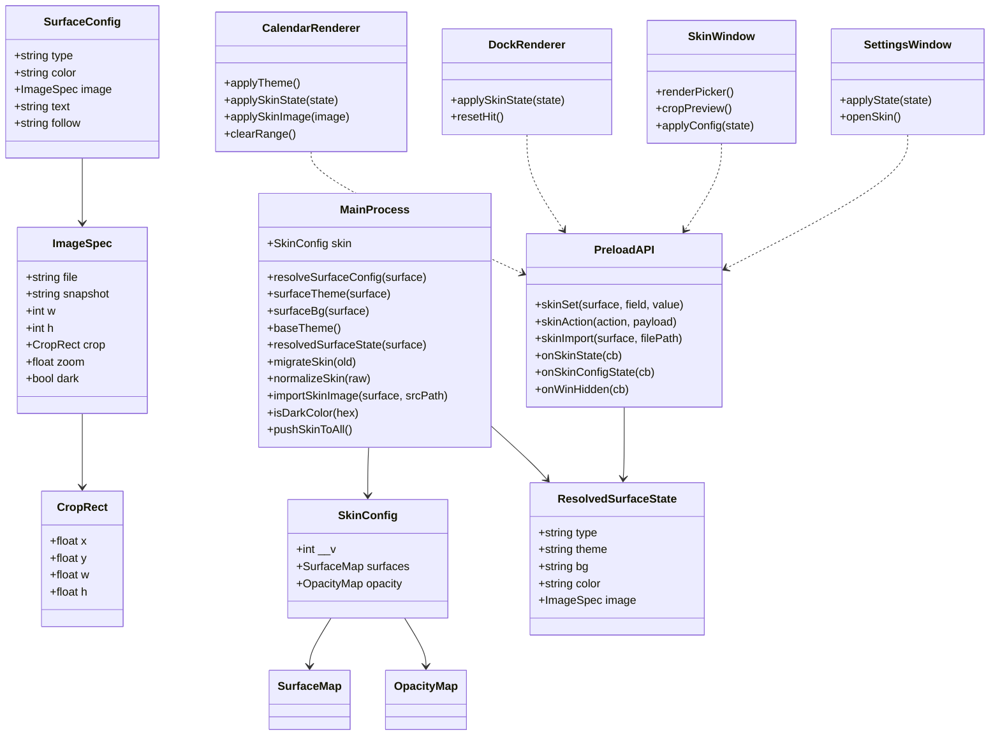

# 简洁桌面日历 · v2.4.0 第二轮 · 皮肤重构 + 图片皮肤 · 增量设计 + 任务分解

> 文档性质：**第二轮增量设计**。承接 v2.4.0 第一批（皮肤内联方案），做**形态重构 + 图片皮肤完整实现 + 2 个 bug 修复**。
> 基线：v2.3.2 → 目标 v2.4.0（同一版本号，第二批交付）｜技术栈：Electron 31 + 纯 ES5，无框架、无打包器
> 读者：工程师（实现）、QA（验收）
> 配套：`v2.4.0-增量PRD-第二轮-皮肤重构+图片皮肤.md`（本文需求编号 A-bug1/A-bug2/B1~B4/C/D 与之对应）

---

## Part A：系统设计

### 1. 实现方案（难点取舍）

| 难点 | 结论 / 方案 |
|---|---|
| **皮肤形态重构** | 从「全局 `skinMode/nativeSkin` + 单层纯色」升级为 **per-surface 配置树** `skin.surfaces{calendar,expanded,desktop,dock}`。每个表面独立 `type∈light\|dark\|system\|color\|image` + `color/image/text`；`expanded/desktop` 带 `follow='calendar'`，`dock` 独立。透明度收敛为 `skin.opacity{calendar,desktop,dock}`（`opacity.calendar` 同时作用于 mini 与 max，窗口级共享）。 |
| **per-surface 生效明暗** | `surfaceTheme(surface)` 唯一入口：light→light、dark→dark、system→系统深浅、color/image→`text` 字段（auto 由背景亮度推导、light→浅底深字、dark→深底浅字）。非表面窗口与托盘跟随 **日历表面** 的生效明暗作基准主题。 |
| **日历 vs 放大同一窗口** | 透明度窗口级天然共享（`opacity.calendar` 一个值）。背景层（纯色/图片）按 `.max` 态在渲染层切 `calendar`/`expanded` 两套背景变量/图片。主进程对主窗下发 `{calendar, expanded}` 两份 resolved 状态，渲染层 `onExpandChanged` 时切换。 |
| **图片皮肤** | 图片作为**独立背景层**：`<div class="skin-img">` 用 `background-image`（Chromium 原生支持 GIF 动画），`background-size/position` 由归一化 `crop+zoom` 换算（见 §4）。导入即原子复制到 `userData/skins/`，仅存文件名引用，绝不引用原始绝对路径。 |
| **图片访问权限** | 注册**自定义特权协议 `skin://`**：`protocol.registerSchemesAsPrivileged` + `protocol.handle('skin', …)` 把 `skin://{文件名}` 映射到 `userData/skins/{文件名}`。这是加载 userData 下本地图片的唯一干净方式（file:// 跨目录被 Chromium 同源策略阻断，`webSecurity:false` 不可取，dataURL 对大图内存开销大）。 |
| **图片平均亮度采样** | **主进程采样**：`nativeImage.createFromPath(file).resize({width:64}) → toBitmap()` 取像素均值，沿用 WCAG 相对亮度 < 0.5 判定。主进程是唯一真相，避免「渲染层算亮度再回传」的往返与多端漂移；缩略图采样把 4096px 大图降到 64px，CPU 开销可忽略。GIF 用首帧亮度（`nativeImage` 读首帧），与「冻结帧」一致。 |
| **GIF 冻结** | 渲染层 `background-image` 播放动画；窗口 `hide()`/`document.hidden` 时 Electron 默认 `backgroundThrottling:true` 停绘。**确定性冻结**：导入 GIF 时主进程用 `nativeImage.createFromPath(gif).toPNG()` 生成首帧 `snapshot.png` 存 `image.snapshot`，渲染层在 `win-hidden`/`visibilitychange` 切到 snapshot（静态）→ 确定性停帧 + 省 CPU；显示时切回动图。 |
| **跟随 copy-on-write** | 取消「跟随日历」时：`surface.follow=null`，并把日历当前 `type/color/image/text` **深拷贝**进该表面作为初始快照；勾回时 `follow='calendar'`。 |
| **旧数据一次性迁移** | 见 §2.3。以 `skin.__v===2` 为迁移标记；迁移后 `saveSettings()` **只写新 `skin` 对象、不再写旧字段**，`loadSettings()` 仍读旧字段作一次性迁移。 |
| **A-bug1 桌面插件不清 range** | 桌面插件是独立 `desktopWin`，复用了 `calendar.html?mode=desktopWidget`，但**没有 blur 处理**。接入点：`createDesktopWidget` 增加 `desktopWin.on('blur')` → `webContents.send('win-hidden')`；渲染层已有 `onWinHidden → clearRange()`，**复用该信号**（桌面插件仅清 range、不隐藏窗口）。 |
| **A-bug2 日历点外部不收起** | 根因定位见 §7：`win.on('blur')` 里 `const fw = BrowserWindow.getFocusedWindow(); if (fw && !fw.isDestroyed()) return;` 这句**过于宽松**——点空白桌面/任务栏时 Windows 焦点不落在任何应用窗口，`getFocusedWindow()` 仍返回陈旧/自身窗口（非 null），导致误判「焦点仍在本应用」而跳过隐藏。 |

---

### 2. 数据模型

#### 2.1 目标 schema（settings.json 内 `skin` 对象）

```jsonc
"skin": {
  "__v": 2,                              // 迁移标记：=2 表示已迁移到 per-surface 结构
  "surfaces": {
    "calendar": {
      "type": "light",                   // light|dark|system|color|image
      "color": null,                     // type=color: '#RRGGBB'
      "image": null,                     // type=image: ImageSpec
      "text": "auto"                     // auto|light|dark（color/image 生效）
    },
    "expanded": {
      "follow": "calendar",              // 'calendar'|null；默认跟随
      "type": "light", "color": null, "image": null, "text": "auto"
    },
    "desktop": {
      "follow": "calendar",
      "type": "light", "color": null, "image": null, "text": "auto"
    },
    "dock": {
      "type": "light", "color": null, "image": null, "text": "auto"   // 独立，无 follow
    }
  },
  "opacity": { "calendar": 1.0, "desktop": 1.0, "dock": 1.0 }
}
```

```jsonc
// ImageSpec（image 子对象）
"image": {
  "file": "calendar_1700000000000.png",      // userData/skins/ 内文件名（消毒）
  "snapshot": "calendar_1700000000000_frame.png",  // 仅 GIF：首帧冻结帧；静态图为 null
  "w": 1280, "h": 853,                        // 原图尺寸（取景数学必需，导入时写入）
  "crop": { "x": 0.2, "y": 0.1, "w": 0.6, "h": 0.8 },   // 归一化 0~1
  "zoom": 1.0,
  "dark": false                               // 缓存：auto 明暗推导结果（首帧亮度）
}
```

#### 2.2 内存结构（electron-main.js 全局）

```js
let skin = {
  __v: 2,
  surfaces: {
    calendar: { type:'light', color:null, image:null, text:'auto' },
    expanded: { follow:'calendar', type:'light', color:null, image:null, text:'auto' },
    desktop:  { follow:'calendar', type:'light', color:null, image:null, text:'auto' },
    dock:     { type:'light', color:null, image:null, text:'auto' }
  },
  opacity: { calendar: 1, desktop: 1, dock: 1 }
};
```

透明度不再使用散落的 `mainOpacity/desktopOpacity/dockOpacity`，统一读 `skin.opacity.*`（旧全局删除/别名）。

#### 2.3 旧字段一次性迁移（具体实现路径）

`loadSettings()` 开头：

```js
if (o.skin && o.skin.__v === 2 && o.skin.surfaces) {
  skin = normalizeSkin(o.skin);            // 已迁移：直接读新结构，不写旧字段
} else {
  skin = migrateSkin(o);                   // 一次性迁移
  // 迁移后在 saveSettings 里只写 skin.__v=2，不再写旧字段
}
```

`migrateSkin(o)` 规则（对齐 PRD §5.4）：

| 旧字段 | 迁移目标 |
|---|---|
| `o.nativeSkin`（缺省回退 `o.theme`） | `calendar.type`（light/dark/system） |
| `o.skinMode==='custom'` 且 `o.skinColor.calendar` 非空 | `calendar.type='color'` + `calendar.color` |
| `o.skinColor.desktop` 非空 且 `o.desktopFollowCalendar===false` | `desktop.type='color'` + `desktop.follow=null` |
| `o.skinColor.dock` 非空 | `dock.type='color'` + `dock.color` |
| `o.dockFollowCalendar` | **丢弃**（浮动改独立） |
| `o.mainOpacity` / `o.desktopOpacity` / `o.dockOpacity` | `opacity.calendar/desktop/dock` |
| 未覆盖项 | expanded/desktop 初始 `follow='calendar'`；dock 初始 `type=calendar.type` |

`normalizeSkin(s)`：补齐缺省字段、`validHex` 校验 color、校验 `image.crop/zoom` 范围、`image.file` 只取 basename（防路径穿越）、`follow` 归一为 `'calendar'|null`、`text` 归一为 `auto|light|dark`。

**迁移标记与「不写旧字段」**：`saveSettings()` 写出时**只写 `skin`**（含 `__v:2`），**删除** `theme/skinMode/nativeSkin/skinColor/desktopFollowCalendar/dockFollowCalendar/mainOpacity/desktopOpacity/dockOpacity` 这些旧键；`loadSettings()` 仍保留对旧键的读取兼容（仅用于升级那一瞬间）。

---

### 3. per-surface 生效明暗推导 + 广播

#### 3.1 核心函数（主进程唯一真相）

```js
// 跟随解析：expanded/desktop 若 follow='calendar' → 直接返回 calendar 配置（copy-on-write 已在写时物化）
function resolveSurfaceConfig(surface) {
  var c = skin.surfaces[surface];
  if ((surface === 'expanded' || surface === 'desktop') && c.follow === 'calendar') {
    return skin.surfaces.calendar;
  }
  return c;
}

function surfaceTheme(surface) {
  var c = resolveSurfaceConfig(surface);
  if (c.type === 'light') return 'light';
  if (c.type === 'dark')  return 'dark';
  if (c.type === 'system') return nativeTheme.shouldUseDarkColors ? 'dark' : 'light';
  // color / image → text 字段
  if (c.text === 'light') return 'light';
  if (c.text === 'dark')  return 'dark';
  var dark = (c.type === 'color')
    ? isDarkColor(c.color)
    : (c.image ? !!c.image.dark : false);
  return dark ? 'dark' : 'light';
}

function surfaceBg(surface) {
  var c = resolveSurfaceConfig(surface);
  if (c.type === 'color') return { kind:'color', color:c.color };
  if (c.type === 'image') return { kind:'image', image:c.image };
  return { kind:'native' };   // light/dark/system → 原生 token 背景
}

// 基准主题：非表面窗口 + 托盘跟随「日历表面」生效明暗
function baseTheme() { return surfaceTheme('calendar'); }
```

`recomputeTheme()` 语义变为 `baseTheme()` 的别名（保留函数名以兼容旧调用点，内部返回 `surfaceTheme('calendar')`）。

#### 3.2 下发给渲染层的 ResolvedSurfaceState

```js
{
  type: 'light|dark|system|color|image',
  theme: 'light|dark',       // 生效明暗 → data-theme（决定状态色 + 文字 token）
  bg: 'native|color|image',  // 背景层类型
  color: '#RRGGBB'|null,     // bg=color
  image: ImageSpec|null      // bg=image
}
```

#### 3.3 广播矩阵

| 通道 | 载荷 | 接收方 |
|---|---|---|
| `theme-changed` | `baseTheme()`（日历表面生效明暗） | remindlist（关注列表，仅非表面实时订阅窗口） |
| `settings-state` | `{ theme: baseTheme(), … }` | settings.html（自身主题跟随基准） |
| `skin-state` | **主窗**：`{ calendar, expanded }`；**桌面**：`{ desktop }`；**浮动**：`{ dock }` | calendar.html（主窗+桌面）、dock.html |
| `skin-config-state` | 完整 `skin` 对象 + 各表面 resolved 结果 + 各表面取景框比例 | skin.html（皮肤窗口回显与编辑） |
| `skin-import-result` | `{ ok, surface, image, error }` | skin.html（导入结果） |
| 托盘图标 | `trayIconByTheme()` 用 `baseTheme()` | 托盘 |

`pushThemeToAll()` 改为 `pushBaseTheme()`（托盘反色 + remindlist + settings 回推）；日历/桌面/浮动不再走 `theme-changed`，改由 `skin-state.theme` 驱动。

---

### 4. 图片皮肤：取景数学 / 亮度 / 加载 / GIF

#### 4.1 取景数学（归一化 crop + zoom ↔ CSS background）

约定：
- 原图尺寸 `IW×IH`（`image.w/h`，导入时主进程读入）。
- 取景框尺寸 `VW×VH`：日历 340×430、放大 340×430、桌面 340×370、浮动 116×50。
- 存储 `crop{x,y,w,h}`（0~1）与 `zoom`（1~5）。

**正向（存储 → 渲染层 CSS）：**

1. ROI 像素矩形：`cx = crop.x*IW`，`cy = crop.y*IH`，`cw = crop.w*IW`，`ch = crop.h*IH`。
2. ROI cover 缩放：`s0 = max(VW/cw, VH/ch)`。
3. 总缩放：`s = s0 * zoom`。
4. `background-size = (IW*s)px (IH*s)px`。
5. ROI 中心对齐取景框中心：
   - `centerX = cx + cw/2`，`centerY = cy + ch/2`。
   - `posX = VW/2 - centerX*s`，`posY = VH/2 - centerY*s`。
   - `background-position = posX px posY px`。

**反向（拖拽/缩放 → 存储）：**

渲染层维护 `s`（当前总缩放，初始 `s0 = max(VW/IW, VH/IH)`）与 `center`（取景框中心对应的图像像素点，初始 `(IW/2, IH/2)`）：

- 拖动 `(dx,dy)` 视口像素：`center.x -= dx/s`，`center.y -= dy/s`（图像随鼠标同向平移）。
- 缩放至 `z`（1~5，以取景框中心锚点）：`s = s0 * z`（center 不变）。
- 落盘：
  - 可见源矩形 `vw = VW/s`，`vh = VH/s`。
  - `crop.x = clamp((center.x - vw/2)/IW, 0, 1 - vw/IW)`；`crop.y = clamp((center.y - vh/2)/IH, 0, 1 - vh/IH)`。
  - `crop.w = vw/IW`，`crop.h = vh/IH`。
  - `zoom = s / s0`。

**一致性结论**：`crop.w/h` 由 `zoom` 与「取景框/原图宽高比」唯一确定（冗余存储、向前兼容）；`crop.x/y` + `zoom` 是权威平移/缩放参数，与屏幕 DPI 无关，故重启后任意分辨率复现一致。`zoom=1` 时 ROI 恰好 cover 铺满；`zoom` 越大 crop 矩形越小。

#### 4.2 图片平均亮度采样（结论）

**主进程采样**：`nativeImage.createFromPath(file).resize({ width: 64 }).toBitmap()` → 遍历 BGRA 求均值 → WCAG 相对亮度 < 0.5 → `image.dark`。理由：主进程唯一真相、缩略图采样零性能风险、GIF 取首帧与冻结帧一致。webp 能否解码取决于 Electron nativeImage（Chromium 解码器，一般支持）；解码失败则导入时拒绝。

#### 4.3 图片数据流

1. **导入**（skin.html 拖入 / `skin-action('choose-file')` 走主进程 `dialog.showOpenDialog`）→ 拿到源绝对路径。
2. **校验**：扩展名 ∈ {png,jpg,jpeg,gif,webp}；`fs.statSync` 大小 ≤ 20MB；`nativeImage.createFromPath` 解码取 `getSize()`，最长边 ≤ 4096，失败拒绝。
3. **原子复制**：目标名 `{surface}_{Date.now()}{ext}`（basename 消毒，禁路径穿越）→ 写 `userData/skins/{name}.tmp` → `rename`。
4. **GIF 冻结帧**：扩展名 gif → `nativeImage.createFromPath(gif).toPNG()` 写 `{surface}_{ts}_frame.png` → `image.snapshot`。
5. **亮度**：§4.2 → `image.dark`；写入 `image.w/h`。
6. 更新 `skin.surfaces[surface].type='image'` + `image`，`saveSettings()` + 推 `skin-state`（实时预览）+ `skin-config-state`。
7. **加载**：渲染层 `<div class="skin-img">` 用 `background-image: url('skin://{file}')`（经 `skin://` 协议映射到 `userData/skins/`）。

#### 4.4 GIF 冻结实现

- 播放：`background-image: url('skin://{file}')`（Chromium 对 animated GIF 的 background-image 也播放）。
- 冻结：渲染层监听 `win-hidden`（日历）/ `document.visibilitychange`（dock/桌面），置 `data-frozen`；CSS `[data-frozen] .skin-img { background-image: url('skin://{snapshot}'); }`（静态首帧）；解除时切回 `{file}`。主进程在导入 GIF 时生成 snapshot，静态图 snapshot=null（无需冻结）。

---

### 5. IPC 变更 + preload 扩展

#### 5.1 新增/变更通道

| 通道 | 方向 | 说明 |
|---|---|---|
| `skin-set` | 渲染→主 | 皮肤窗口写操作。载荷 `{ surface, field, value }`；field ∈ `type/color/text/follow/opacity/image` |
| `skin-action` | 渲染→主 | `{ action }`：`close`（关皮肤窗）、`choose-file`（主进程文件对话框，载荷带 surface） |
| `skin-import` | 渲染→主（invoke） | `(surface, srcPath)` → 返回 `{ ok, image, error }`（拖入路径导入，§4.3） |
| `skin-config-state` | 主→渲染 | 完整 `skin` + resolved + 取景框比例表，皮肤窗回显 |
| `skin-state` | 主→渲染 | 载荷升级为 per-surface resolved（主窗 `{calendar,expanded}`） |
| `settings-action` | 渲染→主 | 扩展 `open-skin`（设置页「皮肤设置」入口打开皮肤窗） |
| `set-theme` | 渲染→主 | 语义改为「日历表面 native light↔dark 快捷切换」（主窗 themeBtn） |

#### 5.2 preload.js 新增桥

```js
skinSet: function (surface, field, value) { ipcRenderer.send('skin-set', { surface: surface, field: field, value: value }); },
skinAction: function (action, payload) { ipcRenderer.send('skin-action', { action: action, payload: payload }); },
skinImport: function (surface, filePath) { return ipcRenderer.invoke('skin-import', surface, filePath); },
onSkinConfigState: function (cb) { ipcRenderer.on('skin-config-state', function (e, s) { try { cb && cb(s); } catch (err) {} }); },
onSkinImportResult: function (cb) { ipcRenderer.on('skin-import-result', function (e, r) { try { cb && cb(r); } catch (err) {} }); }
// 既有 onSkinState / onWinHidden / onSettingsState 保留，onSkinState 载荷升级
```

---

### 6. CSS 变量 / 渲染层应用约定

#### 6.1 template.html（日历主窗 + 桌面插件共用）

```css
:root {
  --skin-bg-solid: transparent;   /* color 背景 */
}
#skinImg {                           /* 新增图片背景层，插入 #widget 内最底层 */
  position: absolute; inset: 0; z-index: 0;
  background-repeat: no-repeat;
  background-color: transparent;
  pointer-events: none;
}
/* 纯色背景层 */
[data-skin="color"] #widget { background: var(--skin-bg-solid); }
/* 图片背景层：widget 透明，图片层盖底；内容层 z-index 已 ≥2 浮于其上 */
[data-skin="image"] #widget { background: transparent; }
[data-frozen] #skinImg { /* 冻结帧由 JS 换 background-image 到 snapshot */ }
```

- 生效明暗由 `data-theme` 全量驱动（`applyTheme()` 逻辑不变），状态色（今日蓝/节假日红/选中绿/`--accent`）随 `data-theme` 走，皮肤**只改背景层**。
- `applySkinState(s)` 新逻辑：`S.theme = s.theme; applyTheme();`（设 `data-theme`）→ 再按 `s.bg` 设 `data-skin=color/image/none` 与 `--skin-bg-solid` / `#skinImg` 的 background-size/position。
- **mini↔max 切换**：app.js 持有 `skinCalendar` 与 `skinExpanded`；`onExpandChanged(expanded)` 时 `applySkinState(expanded ? skinExpanded : skinCalendar)`。

#### 6.2 dock.html

- 与 template 同理：`[data-skin="color"] #card { background: var(--skin-bg-solid); }`；`[data-skin="image"] #card { background: transparent; }` + `#skinImg` 层；`data-theme` 由 `skin-state.theme` 驱动。

#### 6.3 skin.html / settings.html

- 皮肤窗口与设置窗口自身**不应用皮肤背景**，只跟随基准主题（`baseTheme()` → `data-theme`）。
- skin.html 内嵌**取景预览**：一个固定比例（按选中表面）的取景框 `div`，内套 `#skinImg`（`background-image: url('skin://{file}')`），拖拽/滚轮实时改 `s/center` 并预览；确认后按 §4.1 反向换算 `crop/zoom` 落盘。

---

### 7. 两个 bug 根因与修复

#### A-bug1 · 桌面插件窗口外点击不清 range

- **根因**：`desktopWin` 复用 `calendar.html?mode=desktopWidget`，但 `createDesktopWidget()` 未注册任何 `blur` 处理；`win-hidden` 仅由主窗 `win.on('hide')` 下发，桌面插件无此链路。
- **接入点**：`createDesktopWidget()` 增加：
  ```js
  desktopWin.on('blur', function () {
    try { if (desktopWin && desktopWin.webContents && !desktopWin.webContents.isDestroyed()) desktopWin.webContents.send('win-hidden'); } catch (e) {}
  });
  ```
  **复用 `win-hidden`**（app.js 已订阅 `onWinHidden → clearRange()`，桌面插件**只清 range、不隐藏**）。无需新增 preload/渲染层代码。

#### A-bug2 · 日历点外部收起时灵时不灵

- **根因（已读代码确认）**：`win.on('blur')` 内
  ```js
  const fw = BrowserWindow.getFocusedWindow();
  if (fw && !fw.isDestroyed()) return;   // ← 过于宽松
  ```
  点空白桌面/任务栏时 Windows 焦点不落在任何应用窗口，`getFocusedWindow()` 仍返回**陈旧/自身/置顶 dock 窗口**（非 null）→ 误判「焦点仍在本应用」→ 跳过 `hideMain()`。只有点浮动插件（插件 toggle 主动 `toggleFromTray`）才收起。
- **修复（稳定方案）**：
  1. **删除** `getFocusedWindow()` 那条宽松判断。
  2. 显式逐个判断**已知兄弟窗口**是否 `isFocused()`：
     ```js
     win.on('blur', function () {
       if (Date.now() < blurGraceUntil) return;
       try {
         if (dockWin      && !dockWin.isDestroyed()      && dockWin.isFocused())      return;
         if (desktopWin   && !desktopWin.isDestroyed()   && desktopWin.isFocused())   return;
         if (settingsWin  && !settingsWin.isDestroyed()  && settingsWin.isFocused())  return;
         if (skinWin      && !skinWin.isDestroyed()      && skinWin.isFocused())      return;
         if (remindlistWin && !remindlistWin.isDestroyed() && remindlistWin.isFocused()) return;
         if (reminderWin  && !reminderWin.isDestroyed()  && reminderWin.isFocused())  return;
       } catch (e) {}
       hideMain();
     });
     ```
  3. `blurGraceUntil` 保留用于**原生菜单弹出**（`dock-show-menu`/`main-show-menu` 的 800ms）与**唤起路径**（toggleFromTray/goto 的 350ms）；`win.on('show') → blurGraceUntil=0` 已存在，保证显示后真实 blur 正常隐藏。
  4. 兜底日志：隐藏被跳过时写一条 `log('blur: skip hide, focus on ...')`，满足「calendar.log 无反复失败特征」的验收。

---

### 8. 文件清单

**修改：**

| 文件 | 改动 |
|---|---|
| `electron-main.js` | 皮肤中枢重构为 `skin` 对象 + `resolveSurfaceConfig/surfaceTheme/surfaceBg/baseTheme/resolvedSurfaceState`；`migrateSkin/normalizeSkin` 一次迁移；`skin://` 协议注册；图片导入（校验/复制/亮度/GIF 快照）；`skinWin` 窗口管理 + `skin-set/skin-action/skin-import/skin-config-state`；`skin-state` 载荷升级；透明度改读 `skin.opacity.*`；A-bug1/A-bug2 修复 |
| `preload.js` | 新增 `skinSet/skinAction/skinImport/onSkinConfigState/onSkinImportResult`；`onSkinState` 载荷升级 |
| `app.js` | `applySkinState`（theme+背景层解耦，按 `.max` 切 calendar/expanded）；`applySkinImage`（crop/zoom → CSS）；`#skinImg` 层初始化；移除 `onThemeChanged` 依赖（改由 skin-state.theme 驱动） |
| `template.html` | 新增 `#skinImg` 层 + `[data-skin=color/image]` 规则 + `--skin-bg-solid`；`[data-frozen]` 规则 |
| `dock.html` | 新增 `#skinImg` 层 + `[data-skin=color/image]` 规则；`applySkinState` 升级；GIF 冻结 |
| `settings.html` | 删除内联皮肤选择器/色盘/跟随开关，保留「皮肤设置」入口按钮 + 非皮肤项；`settings-action('open-skin')` |
| `skin.html`（新增） | 独立皮肤窗：4 界面分段 + 5 类型 + 色盘 + 图片取景（拖入/平移/缩放）+ 文字明暗 + 透明度 + 跟随开关（copy-on-write） |
| `verify_v1721.js` | 版本仍 2.4.0；新增皮肤重构/迁移/图片/A-bug 断言 |
| `smoke-test.js` | mock 扩展（`protocol`、`nativeImage.resize/toBitmap/toPNG`、`dialog`、`getDisplayMatching`）跑迁移+皮肤+协议冒烟 |
| `runtime-test_v1721.js` | 新增 `surfaceTheme/resolveSurfaceConfig/migrateSkin/cropMath` 运行时单测（`extractFn` 抽真实函数） |
| `PROGRAM_SPEC.md` / `CHANGELOG.md` | 文档/日志同步 2.4.0 第二轮 |

**注意**：`build.js` 内联 `lunar.min.js + app.js` 进 `template.html` → `calendar.html`；新增 `skin.html` 需加入 `package.json` 的 `build.files` 打包清单（与 `settings.html` 并列），`build.js` 无需改（skin.html 独立文件，不经内联）。

---

### 9. 数据结构与接口（类图）



---

### 10. 程序调用流程（时序图）

```mermaid
sequenceDiagram
    autonumber
    participant SET as settings.html
    participant SKIN as skin.html
    participant M as electron-main.js
    participant CAL as calendar.html(app.js)
    participant DOCK as dock.html
    participant OS as 系统(nativeTheme/screen)

    Note over M: 启动 + 旧数据迁移
    M->>M: loadSettings() → o.skin.__v===2 ? normalizeSkin : migrateSkin
    M->>M: baseTheme() = surfaceTheme('calendar')
    M->>M: createWindow/createDock/createDesktopWidget
    M-->>CAL: skin-state({calendar,expanded})
    M-->>DOCK: skin-state({dock})
    M->>OS: protocol.handle('skin') + nativeTheme.on('updated')

    Note over SET,SKIN,M: 皮肤设置入口 + 独立窗口
    SET->>M: settings-action('open-skin')
    M->>M: create skinWin (loadFile skin.html?theme=baseTheme)
    M-->>SKIN: skin-config-state(full skin + resolved + 比例表)

    Note over SKIN,M: 切换皮肤类型 / 纯色 / 跟随 / 透明度
    SKIN->>M: skin-set({surface,field,value})
    M->>M: 更新 skin.surfaces → 若 follow 取消则 copy-on-write 物化
    M->>M: saveSettings()（只写 skin.__v=2）
    M-->>CAL: skin-state(新 resolved)
    M-->>DOCK: skin-state(新 resolved)
    M-->>SKIN: skin-config-state

    Note over SKIN,M: 图片导入
    SKIN->>M: skin-import(surface, srcPath) [invoke]
    M->>M: 校验 ext/≤20MB/最长边≤4096 → 原子复制 userData/skins/
    M->>M: nativeImage 读 w/h + 64px 缩略图亮度 → image.dark + GIF 首帧 snapshot
    M-->>SKIN: {ok, image}
    SKIN->>SKIN: 取景预览（拖拽/滚轮 1×~5×）→ 反向换算 crop/zoom
    SKIN->>M: skin-set({surface, field:'image', value:{file,crop,zoom}})
    M-->>CAL: skin-state({... image})

    Note over OS,M: 跟随系统实时（per-surface）
    OS->>M: nativeTheme updated
    M->>M: 各 surface 独立 surfaceTheme()；system 表面重算
    M-->>CAL: skin-state（theme 更新）
    M-->>DOCK: skin-state（theme 更新）
    M->>M: tray.setImage(baseTheme) + pushSettingsState

    Note over M,CAL,DOCK: A-bug1 / A-bug2
    M->>M: desktopWin.on('blur') → send 'win-hidden'（桌面插件清 range）
    CAL->>M: （用户点日历窗口外部）
    M->>M: win.on('blur')：blurGraceUntil? 或兄弟窗口 isFocused? → 跳过，否则 hideMain()
    M-->>CAL: win-hidden
    CAL->>CAL: clearRange()
```

---

### 11. 依赖包列表

**无需新增任何第三方包。** 全部来自 Electron 31 内置：`protocol`（`registerSchemesAsPrivileged` / `handle`）、`nativeImage`（`resize/toBitmap/toPNG/getSize`）、`nativeTheme`、`dialog`、`screen`。渲染层用原生 `<input type="file">`（拖入）与 `<input type="color">`，零依赖、ES5 兼容。

---

### 12. 任务列表（有序，含依赖）

| 任务 | 名称 | 涉及文件 | 依赖 | 优先级 | 验收要点 |
|---|---|---|---|---|---|
| **T01** | 数据模型重构 + 一次迁移 + per-surface 明暗中枢 | `electron-main.js`、`preload.js`、`verify_v1721.js` | 无 | P0 | ① `skin` 新结构 load/save/一次迁移正确，迁移后不再写旧字段；② `surfaceTheme/resolveSurfaceConfig/baseTheme` 五类 type 推导正确；③ `skin-state` 载荷升级、非表面窗口跟随日历基准主题；④ 透明度统一读 `skin.opacity.*`；⑤ mock 冒烟不炸 |
| **T02** | 渲染层皮肤应用重构（calendar/expanded 切换 + 背景层 + 透明度语义） | `template.html`、`app.js`、`dock.html`、`electron-main.js` | T01 | P0 | ① mini↔max 正确切 `calendar/expanded` 背景与明暗；② 纯色/图片背景层生效、状态色不直接改；③ 桌面/放大默认跟随、取消后 copy-on-write 独立；④ 透明度窗口级共享且独立于背景层；⑤ 重启复现一致 |
| **T03** | 独立皮肤窗口 skin.html + IPC + 设置页入口 | `skin.html`、`settings.html`、`electron-main.js`、`preload.js` | T01 | P0 | ① 设置页仅留「皮肤设置」入口；② skin.html 4 界面分段 + 5 类型 + 色盘 + 文字明暗 + 透明度 + 跟随开关；③ ✕/Esc/表头拖动；④ 深色下自身配色正常；⑤ 操作即时生效并落盘 |
| **T04** | 图片皮肤完整实现（导入/取景/GIF/亮度/`skin://`） | `electron-main.js`、`skin.html`、`app.js`、`template.html`、`dock.html` | T03 | P0 | ① 拖入/点选导入 png/jpg/gif/webp，校验 ≤20MB/≤4096 拒绝；② 原子复制 userData/skins、删原文件不影响；③ 4 界面取景比例正确、拖拽/滚轮 1×~5×、crop/zoom 重启复现；④ GIF 动画 + 隐藏冻结；⑤ 文字自动明暗 + 手动深/浅 |
| **T05** | A-bug1/A-bug2 修复 + 测试补全 + 文档/构建校验 | `electron-main.js`、`app.js`、`verify_v1721.js`、`smoke-test.js`、`runtime-test_v1721.js`、`PROGRAM_SPEC.md`、`CHANGELOG.md`、`package.json` | T01~T04 | P0 | ① 桌面插件窗口外点击立即清 range；② 日历点外部 30 连击 0 次不收起、不依赖点插件；③ `npm run check` 全绿；④ `npm run build` 成功（skin.html 进 build.files）；⑤ 文档同步 |

---

### 13. 共享知识（跨文件约定）

- **表面枚举**：`surface ∈ {calendar, expanded, desktop, dock}`；`type ∈ {light, dark, system, color, image}`；`text ∈ {auto, light, dark}`；`follow ∈ {'calendar', null}`。
- **跟随语义**：`expanded/desktop` 默认 `follow='calendar'`；运行时 `resolveSurfaceConfig` 直接返回 calendar 配置；取消跟随时**物化 copy-on-write**（深拷贝 calendar 的 `type/color/image/text`）。
- **基准主题**：`baseTheme() = surfaceTheme('calendar')`，供托盘图标 / 关注列表 / 提醒弹窗 / 设置窗 / 皮肤窗自身使用。
- **`skin://` 协议**：`skin://{basename}` → `userData/skins/{basename}`；渲染层加载皮肤图片唯一用该协议，禁止直接 file:// 跨目录。
- **图片文件命名**：`{surface}_{Date.now()}{ext}`（消毒 basename）；GIF 冻结帧 `{surface}_{ts}_frame.png`。
- **取景数学**：以 §4.1 公式为准；`crop.w/h` 为 `zoom` 的派生冗余，权威参数 `crop.x/y + zoom`。
- **亮度判定**：`isDarkColor`（纯色）与 `image.dark`（图片，64px 缩略图采样）统一「相对亮度 < 0.5 → 深底浅字」。
- **透明度**：`skin.opacity.{calendar,desktop,dock}`；`opacity.calendar` 同时作用于 mini/max（窗口级）；`setOpacity` 独立于背景层。
- **回写范式**：延续「主进程唯一真相、无保存按钮」，皮肤窗口所有编辑走 `skin-set`，主进程处理后推 `skin-config-state` + `skin-state`。
- **blur 约定**：隐藏主窗唯一收口 `hideMain()`；兄弟窗口判定只用 `isFocused()`（不再用 `getFocusedWindow()` 宽松判定）；菜单/唤起用 `guardBlur(ms)`。

---

### 14. 待确认事项（已按 PRD 建议拍板处直接采用，此处仅列可调项）

1. **`theme` 旧字段彻底停写**：本轮 `saveSettings()` 停止写 `theme` 镜像（迁移后仅存 `skin`）；`theme` 仅作 `migrateSkin` 的回退读源。若仍需保留 `theme` 供第三方诊断，可一行加回（不影响架构）。
2. **webp 依赖 Chromium 解码**：Electron 31 的 `nativeImage` 对 webp 一般可解，若个别环境失败则导入时 toast 拒绝；如需硬保证可把 webp 从白名单移除（产品已建议可 `png/jpg/gif`）。
3. **GIF 冻结的 snapshot 只对 GIF 生成**：静态图不生成快照（`snapshot=null`），冻结逻辑对静态图无感。
4. **图片亮度采样分辨率 64px**：为「成本/精度」折中默认值；如需更准可调 128px（常量化）。

---

*架构师：高见远 ｜ 输出：v2.4.0 第二轮 ｜ 状态：待工程师实现*
