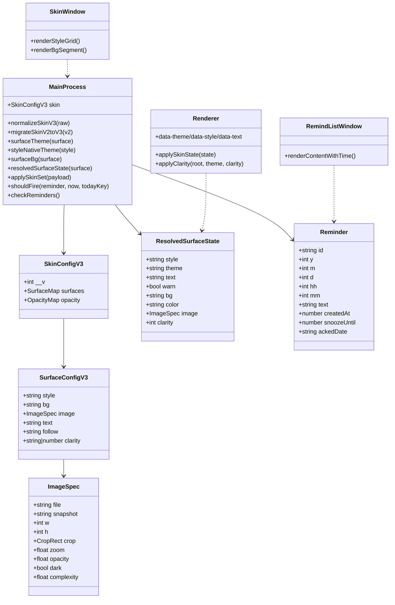

# 简洁桌面日历 · v3.0.0 增量设计（皮肤模型 v3「风格 × 背景」+ 5 项整改）

> 文档性质：**v3.0.0 增量设计**（**只做设计，不改任何代码**）。
> 基线：v2.4.4（已落地 per-surface 皮肤 + 图片皮肤 + `clarity` 清晰度）｜目标：v3.0.0
> 技术栈：Electron 31 + 纯 ES5（`var` + `'use strict'` + 中文块注释），无框架、无打包器。CSS 真身在 `template.html`（日历/桌面插件共用）与 `dock.html`（浮动插件）；`build.js` 把 `lunar.min.js`+`app.js` 内联进 `template.html`→`calendar.html`；`electron-main.js` 为皮肤/设置唯一真相源。
> 读者：工程师（实现）、QA（验收）｜配套样张：`deliverables/design/风格方向对比.html`（5 方向 CSS）

---

## Part A：系统设计

### 1. 产品决策落地总览（7 项决策 → 技术映射）

| 决策 | 技术落地 |
|---|---|
| ① 默认皮肤 = 「玻璃拟态 × 现代极简」融合款 | 新增 `style:'default'`（现代极简排版 + 柔和玻璃质感/柔影）；新装默认 `default` |
| ② 可选共 7 项：默认 / 极简 / 玻璃拟态 / 新拟态 / 科技感 / 温润拟物 / 自选图片 | `style ∈ {default,minimal,glass,neu,tech,warm}`（6 个）+ **背景来源 `bg ∈ {native,image}`**（第 7 项「自选图片」= `bg:'image'`） |
| ③ 风格 × 自选图片 可叠加 | `style` 与 `bg` **正交**：`style` 决定配色/材质/描边/圆角/阴影/强调色；`bg` 决定底层来源（原生材质 vs 用户图片）。`glass + 我的照片` 合法 |
| ④ 删除「纯色/跟随系统/黑夜」；「白日」→「极简」 | UI 移除 `color`/`system`/`dark`；`light` 改名 `minimal`（**升级**为新的极简设计）；底层保留 image 缺图时的 solid fallback（§2.5） |
| ⑤ 产品名保持「简洁桌面日历」 | 不改 `productName`/`appId` |
| ⑥ 本次称 v3.0.0 | `package.json version = 3.0.0`；`skin.__v = 3` |
| ⑦ 老图片皮肤平滑迁移 | 迁移保留 `image`（file/snapshot/w/h/crop/zoom/opacity/dark/complexity）原样，仅补 `style`/`bg`（§2.4） |

---

### 2. A. 皮肤数据模型 v3（`style` × `bg` 双维度）

#### 2.1 完整结构（`settings.json` → `skin`）

```jsonc
"skin": {
  "__v": 3,
  "surfaces": {
    "calendar": {
      "style": "default",            // 风格材质：default|minimal|glass|neu|tech|warm
      "bg":    "native",             // 背景来源：native | image
      "image": null,                 // bg=image 时：ImageSpec（见下）
      "text":  "auto",               // 文字色轴：auto | light(深字) | dark(浅字)
      "clarity": "auto"              // 清晰度：'auto' | 0~100
    },
    "expanded": { "follow": "calendar", "style": "default", "bg": "native", "image": null, "text": "auto", "clarity": "auto" },
    "desktop":  { "follow": "calendar", "style": "default", "bg": "native", "image": null, "text": "auto", "clarity": "auto" },
    "dock":     {                   "style": "default", "bg": "native", "image": null, "text": "auto", "clarity": "auto" }
  },
  "opacity": { "calendar": 1.0, "desktop": 1.0, "dock": 1.0 }
}
```

`ImageSpec`（不变，沿用 v2.4.4）：
```jsonc
{ "file":"calendar_...jpg", "snapshot":null, "w":3024, "h":4032,
  "crop":{"x":0,"y":0,"w":1,"h":1}, "zoom":1.0, "opacity":1.0,
  "dark":true, "complexity":0.62 }
```

#### 2.2 字段语义 / 取值 / 默认值

| 字段 | 取值 | 默认 | 说明 |
|---|---|---|---|
| `style` | `default` `minimal` `glass` `neu` `tech` `warm` | `default` | 风格材质（配色 + 描边 + 圆角 + 阴影 + 强调色 + 状态色）|
| `bg` | `native` `image` | `native` | `native`=该风格自带表面；`image`=用户图片铺底（风格 chrome 仍生效）|
| `image` | `ImageSpec\|null` | `null` | 仅 `bg=image` |
| `text` | `auto` `light` `dark` | `auto` | **只影响文字色与描边/光晕方向**（§3）；`light`=深字、`dark`=浅字，`auto`=跟随背景明暗 |
| `follow` | `calendar` `null` | expanded/desktop=`calendar`；其余无 | 跟随日历（copy-on-write）|
| `clarity` | `'auto'` `0~100` | `'auto'` | 沿用 v2.4.4 |
| `opacity` | `0.3~1.0` | `1.0` | 窗口级透明度，沿用 |

**每个 style 自带 `nativeTheme`（原生底默认明暗）**：`tech → dark`；其余 `→ light`。`bg='image'` 时 `theme` 由 `image.dark` 推导（§3）。

#### 2.3 内存结构（electron-main.js 全局，示意）

```js
var skin = {
  __v: 3,
  surfaces: {
    calendar: { style:'default', bg:'native', image:null, text:'auto', clarity:'auto' },
    expanded: { follow:'calendar', style:'default', bg:'native', image:null, text:'auto', clarity:'auto' },
    desktop:  { follow:'calendar', style:'default', bg:'native', image:null, text:'auto', clarity:'auto' },
    dock:     { style:'default', bg:'native', image:null, text:'auto', clarity:'auto' }
  },
  opacity: { calendar:1, desktop:1, dock:1 }
};
```

#### 2.4 v2 → v3 迁移规则（`migrateSkinV3(o)`，以 `skin.__v === 3` 为标记）

**入口**（`loadSettings()`）：
```js
if (o.skin && o.skin.__v === 3 && o.skin.surfaces) skin = normalizeSkinV3(o.skin);   // 已迁移
else if (o.skin && o.skin.__v === 2) skin = migrateSkinV2toV3(o.skin);               // v2 → v3
else skin = migrateLegacy(o);                                                        // 更老的第一批（保留现有 migrateSkin 路径后再过一遍 V2toV3）
```

`type → (style, bg)` 映射（每表面独立）：

| 旧 `type` | 映射 `style` | 映射 `bg` | 旧 `color` | 旧 `image` | 理由 |
|---|---|---|---|---|---|
| `light` | `minimal` | `native` | 丢 | 丢 | 决策④「白日」→「极简」 |
| `dark` | `tech` | `native` | 丢 | 丢 | 唯一原生深色风格；保住"深色"体验（见 §13.1 待确认） |
| `system` | `default` | `native` | 丢 | 丢 | 「跟随系统」被删，回落到默认融合款 |
| `color` | `default` | `native` | **丢** | 丢 | 纯色被删；降级为默认原生底（**不崩溃、不白屏**）|
| `image` | `default` | `image` | 丢 | **原样保留** | 决策⑦平滑迁移，保留 file/crop/zoom/opacity/dark/complexity |

- `text` / `follow` / `clarity` / `opacity` **原样保留**（语义不变）。
- `normalizeSkinV3` 兜底：`style` 非法→`default`；`bg` 非法→`native`（且非 `image` 时 `image=null`）；`bg=image` 但 `image` 为空→自动回落 `bg='native'`（防白屏）；`text`/`clarity` 归一。
- **旧 `image` 必须是「首选保留」**：迁移绝不删盘上文件、不改 crop/zoom。
- 迁移后 `saveSettings()` **只写 `skin.__v=3` 新结构**，不再写任何旧键（`type/color/theme/nativeSkin/skinMode/skinColor/...`）。

#### 2.5 底层兜底路径结论（重要）

- **`color`（纯色）从 UI 移除，但底层保留 solid fallback**：`bg='image'` 且 `image` 缺失/解码失败时，仍走 `solidFallbackFor()`（按当前 style 的 nativeTheme 取基色），**绝不透明/白屏**。UI 不再暴露"改纯色"能力。
- **`system` 完全移除**：不再读 `nativeTheme.shouldUseDarkColors` 决定皮肤明暗（托盘图标反色逻辑保留，跟随 `baseTheme()`）。
- **`dark` 作为「type」移除**，但**"深底" 语义保留在 `theme` 层**（§3）：`tech` 原生深底；`bg=image` 由图片亮暗决定；每个 style 都提供深色底 token 档（§7）。
- **不保留 `color` 字段**（迁移即丢弃用户自定义纯色）——已获产品确认（决策④）。若需挽留，可在 §13.2 增加"把旧色作为新 `tint` 保留"的可选项。

#### 2.6 `resolvedSurfaceState()` 新增下发字段

```js
function resolvedSurfaceState(surface) {
  var c = resolveSurfaceConfig(surface);
  var theme = surfaceTheme(surface);          // 'light'|'dark'（背景亮暗，§3）
  var text  = (c.text === 'light' || c.text === 'dark') ? c.text : 'auto';   // 文字轴原值
  var warn  = (theme === 'light' && text === 'dark') || (theme === 'dark' && text === 'light');
  var bg = surfaceBg(surface);
  return {
    style: c.style,                            // ★新增
    theme: theme,                              // 背景明暗 → data-theme
    text:  text,                               // ★新增：文字轴 → data-text（'auto'|'light'|'dark'）
    warn:  warn,                               // ★新增：低对比组合标记（§3.4）
    bg:    bg.kind,                            // native|color|image（color 仅兜底出现）
    color: (bg.kind === 'color') ? bg.color : null,
    image: (bg.kind === 'image') ? bg.image : null,
    clarity: clarityForConfig(c)
  };
}
```

广播载荷不变（`skin-state` 主窗 `{calendar,expanded}`、桌面 `{desktop}`、浮动 `{dock}`；`skin-config-state` 带完整 `skin` + resolved + 比例表）。

---

### 3. B. 文字色与主题解耦（用户问题 1）

#### 3.1 根因（已确认）

`electron-main.js:179 surfaceTheme()` 的 187-188 行：
```js
if (c.text === 'light') return 'light';   // ← 把「深字」当成「整窗变浅」
if (c.text === 'dark')  return 'dark';    // ← 把「浅字」当成「整窗变深」
```
`surfaceTheme()` 的返回值 = **整窗明暗**（驱动 `data-theme` → 状态色 token + `--ink` + 背景 token 全量切换）。把 `text`（本应只管文字色）当成 `theme` 返回，导致"一调深浅字，整窗变黑/变白"。

#### 3.2 解耦后语义（改后 `surfaceTheme()`）

`theme`（整窗明暗）**只看背景亮暗**，与 `text` 完全解耦：

```js
function surfaceTheme(surface) {          // = data-theme（背景/表面明暗）
  var c = resolveSurfaceConfig(surface);
  if (c.bg === 'image' && c.image) return c.image.dark ? 'dark' : 'light';  // 图片亮暗
  return styleNativeTheme(c.style);       // tech→dark，其余→light
}

function styleNativeTheme(style) {
  return (style === 'tech') ? 'dark' : 'light';
}
```
删除原 187-188 行对 `c.text` 的误用。

`text` 由渲染层独立成 `data-text`（只改文字色与描边/光晕方向）：

| `text` 值 | `data-text` | 文字色 | 描边/光晕方向 |
|---|---|---|---|
| `auto` | （不设 / `auto`） | 跟随 `data-theme`（浅底→深字，深底→浅字） | 跟随 `data-theme` |
| `light` | `light` | **深字**（浅底语义） | 浅色光罩/浅描边 |
| `dark` | `dark` | **浅字** | 黑光罩/深描边 |

> 命名沿用现状（`skin.html` 现有 `data-text="light"`=深字、`data-text="dark"`=浅字），保持向后兼容与 CSS 一致。

#### 3.3 渲染层 `data-theme` / `data-text` 分工（`app.js` / `dock.html`）

```js
function applySkinState(state) {
  S.theme = state.theme === 'dark' ? 'dark' : 'light';
  var root = document.documentElement;
  root.dataset.theme = S.theme;                       // ① 整窗明暗（背景 + 状态色 + 默认 ink）
  if (state.text && state.text !== 'auto') root.dataset.text = state.text;  // ② 文字轴覆盖
  else delete root.dataset.text;
  root.dataset.style = state.style;                   // ③ 风格材质（§7 全程挂 [data-style]）
  // …背景层（color/image）+ applyClarity（warn=true 时抬 clear 下限，见 §3.4）
}
```

**CSS 变量挂载选择器分工（`template.html` / `dock.html`）**：
- `:root` / `[data-theme="light|dark"]` → 表面 token（`--paper*` / `--ink*` / 状态色 / 阴影）。**背景明暗驱动。**
- `[data-style="…"]` → 六套风格 token（叠加在 `[data-theme]` 之上，§7）。**风格驱动。**
- `[data-text="light"] { --ink: <深字>; --stroke-color/<glow>: <浅向> }`、`[data-text="dark"] { --ink: <浅字>; … }` → **仅文字色与描边/光晕**。
- `[data-text]` 规则必须**只覆盖文字相关变量**（`--ink/--ink-soft/--ink-faint/--stroke-color/--ink-glow` + 状态字色按需），**不得覆盖** `--paper* / --accent / --weekend / --holiday-*`。

#### 3.4 低对比组合（浅底+浅字 / 深底+深字）如何处理

解耦后允许出现"浅底 + 浅字"等低对比组合（用户手动选反了）。处理策略（**三层**）：
1. **主进程标记**：`resolvedSurfaceState().warn = (theme,text) 冲突`（§2.6）。
2. **渲染层兜底**：`warn===true` 时 `applyClarity(root, theme, Math.max(clarity, 35))` —— 提高保护层/光晕，把文字从背景里"托"出来（保留用户选择，不强行反转）。
3. **皮肤窗提示**：`skin.html` 在冲突时显示轻提示条「当前文字与背景对比偏低，建议切换或提高 UI 清晰度」。

---

### 4. C. 定时提醒（用户问题 3）

#### 4.1 数据结构扩展（`reminders.json` 元素，向后兼容）

```jsonc
{
  "id": "r_...",
  "y": 2026, "m": 9, "d": 10,
  "hh": 14, "mm": 30,       // ★新增：0~23 / 0~59；缺省/null = 全天（无具体时刻）
  "text": "开会",
  "createdAt": 1757...,
  "snoozeUntil": 0,
  "ackedDate": ""            // 今天已"知道了"的日期（pad2 格式）
}
```
- `hh`/`mm` **可选**：旧记录无此字段 → 视为**全天提醒**（`hh==null`）。
- `add-reminder` 载荷新增可选 `hh`/`mm`；主进程归一：`hh∈[0,23]`、`mm∈[0,59]`，非整数或越界 → `null`（全天）。
- 后续 `loadReminders()` 的 filter 不变（不因缺 `hh/mm` 被剔除）。

#### 4.2 触发判定（伪代码，替代现 `checkReminders()`）

```js
function shouldFire(r, now, todayKey) {
  var target = new Date(r.y, r.m - 1, r.d);
  if (!isSameYMD(target, now)) return false;            // 不是今天
  if (r.ackedDate === todayKey) return false;            // 今天已"知道了"
  if (r.snoozeUntil && r.snoozeUntil > now.getTime()) return false;  // 稍后提醒未到
  if (r.hh == null || r.mm == null) return true;        // 全天：当天首次巡检即触发
  var fireAt = new Date(r.y, r.m - 1, r.d, r.hh, r.mm, 0);
  return now.getTime() >= fireAt.getTime();             // 到点才弹
}
```
`checkReminders()` 改为遍历 `shouldFire`（一次只弹一个，避免重叠，沿用现状）。

**巡检频率**：保留 60s 轮询；另在启动与系统唤醒时补跑（§4.5）。

#### 4.3 关机/休眠错过的补偿策略

- **同日错过**（如 14:30 触发时机器休眠，15:10 唤醒）→ 唤醒后巡检 `shouldFire` 为真（`now ≥ fireAt`）→ **立即补弹一次**（迟到提醒）。
- **跨日错过**（如 09:00 的提醒，次日才开机）→ `isSameYMD` 为假 → **不补弹**（避免"陈年提醒"骚扰）；该条保留在列表（黄格仍在，用户可自行处理）。
- **触发源**：
  - `app.setInterval(checkReminders, 60*1000)`（保留）；
  - `powerMonitor.on('resume', checkReminders)`（★新增，睡眠唤醒）；
  - `powerMonitor.on('unlock-screen', checkReminders)`（★新增，解锁补跑）；
  - 启动时 `setTimeout(checkReminders, 500)`（保留）。
- **半天内**视为同一逻辑日：`todayKey` 用 `YYYY-MM-DD`（现有 `isSameYMD`/`pad2` 语义，跨零点即翻篇）。

#### 4.4 `remindlist.html` DOM 顺序契约（内容后显示时间、✕ 放最后）

- 列头 `#cols` 保持三列：`日期 | 关注内容 | (空)`。
- 每行 `.row` 顺序**固定**：`[.rl-date] [.rl-text-wrap] [.rl-del]`（`.rl-del` 恒为**最后一列**，`grid-template-columns` 第三列 `24px`）。
- 时间**并入内容列**（不新增列）：内容文本拼接为 `内容 · HH:MM`（有 `hh/mm` 时），无时间则仅 `内容`。
  - 契约：`.rl-text` 文本 = `r.text + (r.hh!=null ? ' · ' + pad2(r.hh)+':'+pad2(r.mm) : '')`。
  - `title` 同步加时间，便于悬停查看。
- 数组渲染前仍按 `y*10000+m*100+d` + `hh*100+mm`（有则）稳定排序。

#### 4.5 IPC 契约（变更点）

| 通道 | 变更 |
|---|---|
| `add-reminder`（invoke）| 载荷新增 `hh?`/`mm?`；主进程归一后落盘。返回的 `r` 含 `hh/mm` |
| `list-reminders`（invoke）| 返回项含 `hh/mm`（旧项为 `null`）|
| `reminders-changed`（主→渲染）| 数组元素含 `hh/mm` |
| `remindlist-data`（主→渲染）| `reminders` 元素含 `hh/mm` |
| `reminder.html` query | `showReminderWindow()` 的 query 增加 `time`（`HH:MM` 或空），供弹窗显示 |
| `ack-reminder` / `remove-reminder` | 不变 |

`app.js` 的提醒输入栏（`#remindInput`）新增两个 `<input type="number">`（时/分，可空=全天），`confirmRemindInput()` 带上 `hh/mm`。

---

### 5. D. 放大窗口换肤按钮移除（用户问题 2）

#### 5.1 现状

- `template.html:909` `#themeBtn`（`.zoom-btn`，内含 `#themeIcon`），渲染由 `app.js:629 syncThemeIcon()` / `644 applyTheme()` 驱动（白日/黑夜图标）。
- **桌面板块模式复用**：`app.js:1176 setDesktopLocked()` 把 `#themeBtn` 的 `innerHTML` 换成锁/解锁 SVG 并改 `title`；`setupDesktopMode()`（`app.js:1205`）只在 `IS_DESKTOP` 时执行。
- 关键事实：**桌面插件窗口恒为 mini 尺寸，永不进入 `.max`（放大）**；`.max` 只出现在主窗。

#### 5.2 方案（推荐：CSS 隐藏 + 移除换肤联动；绝不删 DOM）

因 v3 已删除「黑夜/跟随系统」、换肤入口统一到皮肤设置窗（决策④），主窗换肤键**功能已废弃**；但该 DOM 节点在**桌面模式被复用为锁定键**，**不能删节点、不能删 CSS 类**。

- **DOM 保持不动**（`#themeBtn` 仍在 `.bar-right`）。
- **CSS 控制可见性**（`template.html`）：
  ```css
  /* 默认隐藏换肤键；仅桌面板块模式（锁定键）显示 */
  #themeBtn { display: none; }
  body.desktop-mode #themeBtn { display: flex; }
  ```
  - 主窗（mini + 放大）：`body` 无 `.desktop-mode` → 按钮恒隐藏 → **放大窗口换肤按钮即为"已移除"**。
  - 桌面插件：`body.desktop-mode` → 锁定键正常显示 → **不被误伤**。
- **移除换肤联动**（`app.js`）：`applyTheme()` 不再写 `themeBtnEl.title`/`classList`；`syncThemeIcon()` 删除或仅保留（无调用）；主题按钮点击绑定（`set-theme`/切换）移除。桌面锁逻辑（`setDesktopLocked`/`onLockClick`）**保留不动**。
- **工具栏补位**：`.bar-right` 为 flex，隐藏 `#themeBtn` 后 `#wkSwitch` / `#bookBtn` / `#maxBtn` 自动靠拢，无需改动（无固定间距缺口）。
- **换肤入口统一**：主窗不再需要快捷换肤键；换肤统一走「设置弹窗 → 🎨 皮肤设置」（`settings.html` `#btnSkin` → `settings-action('open-skin')`），右键菜单亦有「皮肤设置」入口。放大窗口仅保留放大键（缩放回 mini）。

> 备选（若坚持彻底移除 DOM）：把锁定键改由 `#bookBtn`（或新按钮）承载，删除 `#themeBtn`。**成本更高、易误伤桌面锁**，不推荐。最终由实现者按最小风险选择，集成点已标注。

---

### 6. E. 四角黑角（用户问题 4）——集成点 + 候选方案

> 实证以任务 #41（最小复现）结论为准；本节只给**集成点**与**候选方案 + 副作用**。

#### 6.1 集成点

| # | 文件 / 位置 | 能挂上的修复开关 |
|---|---|---|
| I1 | `electron-main.js` 各窗口创建（`createWindow`:2061 / `createDesktopWidget`:1816 / `createDock`:2287 / `settingsWin`:1902 / `skinWin`:1929 / `remindlistWin`:2434 / `reminderWin`:2925） | 统一提取 `WIN_BASE` 常量（`transparent/hasShadow/roundedCorners/backgroundColor`）；`hasShadow:false`（★候选）等开关集中于此，一处改全局生效 |
| I2 | `electron-main.js` `bgColorFor(surface)`:400 | 现恒返回 `'#00000000'`；可改为返回**与皮肤基色一致的不透明色**（候选，注意 v2.4.2"方形色块"回归风险）|
| I3 | `template.html` `#widget`（`:root`/`#widget` 规则） | CSS 兜底：`[data-skin="image"] #widget { background: <不透明基色>; }`（避免 `backdrop-filter` 采样透明窗→暗边）；`isolation:isolate` / `background-clip:padding-box`（候选）|
| I4 | `dock.html` `#card` | 同上（浮动插件对应位置）|

#### 6.2 候选方案与副作用评估

| 方案 | 做法 | 对症 | 副作用 / 风险 |
|---|---|---|---|
| **S1 `hasShadow:false`** | I1：透明窗口关系统阴影 | 右上/左缘 1px 暗边（阴影在圆角外交叠） | 失去系统投影（本由渲染层 `box-shadow` 画，通常无感）；需在图片/原生底均回归验证 |
| **S2 图片皮肤加不透明基底** | I3：`[data-skin=image] #widget` 铺基色 | `backdrop-filter` 采样透明 → 暗边 | 若基色露边→出现"色块描边"；需保证 `#skinImg` 完全覆盖 |
| **S3 `bgColorFor` 返回不透明基色** | I2 | 透明窗口边缘抗锯齿暗化 | **高风险**：v2.4.2 曾因不透明 `backgroundColor` 导致"方形色块 + 闪黑"，与圆角/阴影冲突；仅在 S1+S2 无效时考虑 |
| **S4 CSS 抗锯齿补救** | I3：`overflow:clip` 替代 `overflow:hidden`、`isolation:isolate`、内描边 1px 基色 | 圆角边缘混色 | 低风险；但可能无法根除（源于窗口层而非 DOM）|
| **S5 Electron 已知项** | 透明窗口 + `roundedCorners`（部分平台/版本）| 四角 | 平台相关，Windows 行为有限 |

**建议**：优先 S1（低成本、直击窗口层暗边）→ 复现验证；若仍残留，叠加 S2；**慎用 S3**（回归前科）。真实根因与取舍以任务 #41 实证为准。

---

### 7. F. 卸载数据选项（用户问题 5）——NSIS 要点 + 契约

> 任务 #43 并行实现，本节给**契约**。

#### 7.1 原地升级（无需手动卸载）

- 现状 `package.json` `nsis`：`oneClick:false` / `perMachine:false` / `allowToChangeInstallationDirectory:true` / `include:installer.nsh`；`appId:"com.yg.simplecalendar"`（稳定）。
- **契约**：只要 `appId`（→ NSIS `APP_GUID`/注册表 `UninstallString`）**保持不变**，electron-builder 生成的 NSIS 安装包会**检测已装版本并原地覆盖安装**（同 per-user 安装路径），**不会**要求先手动卸载。
- **不要改**：`appId`、`perMachine`、安装目录默认值。给发布说明写明"直接运行新安装包即可升级"。

#### 7.2 卸载时询问是否删除个人数据（`installer.nsh` 扩展）

- **契约**：在 `installer.nsh` 增自定义卸载页 `customUnWelcomePage`（`nsDialogs` 复选框「同时删除个人数据（设置、皮肤图片、特别关注）」），或 `customUnInstall` 宏中读取该选项：
  - 勾选 → 删除 **userData 目录**：`$APPDATA\简洁桌面日历`（含 `settings.json`/`reminders.json`/`skins\`）。
  - 未勾选 → 仅删程序目录，保留个人数据（默认**不勾**，防误删）。
- **路径注意**：userData 路径由 Electron `productName`/`name` 决定（`%APPDATA%\<productName>`）；NSIS 侧需用同一字面量（建议在 `installer.nsh` 顶部 `!define USERDATA_DIR "$APPDATA\简洁桌面日历"`，并加注释与主进程 `app.getPath('userData')` 对齐）。
- **不改主进程逻辑**（卸载清理由安装器负责）；`components`/注册表清理沿用 electron-builder 默认。

---

### 8. G. 6 套风格 token 定义

#### 8.1 通用 token 清单（对齐现存 `:root` 变量）

| 组 | 变量 |
|---|---|
| 表面 | `--paper`（卡面）、`--paper-hi`（顶部高光）、`--paper-edge`（描边）|
| 材质 | `backdrop-filter`（blur/saturate）、是否渐变/纯色 |
| 圆角 | `--r-lg`（卡）、`--r-sm`（格）、`--r-pill` |
| 阴影 | `--e-4`/`--shadow`（+ `--shadow-hover`）|
| 文字 | `--ink`（主）、`--ink-soft`（次）、`--ink-faint`（弱）|
| 强调 | `--accent`、`--accent-strong`、`--accent-ink`、`--accent-soft`、`--accent-line`、`--accent-glow` |
| 状态 | `--weekend`、`--cinnabar`/`--holiday-fg`、`--workday`、`--focus-amber`、`--cell-hover`、`--range-soft`/`--range-softer`/`--range-ink`、`--watermark` |
| 动效 | `--dur-fast`(140ms)、`--dur-normal`(220ms)、`--dur-slow`(340ms)、`--ease-out`、`--ease-in-out` |

**项目既有约定（不改）**：节假日/周末=**红**；**今天=主题强调色**；选中=强调色浅底；特别关注=琥珀；非本月=弱化。

#### 8.2 浅色底（light tier）token 表

| token | 默认(融合) | 极简 | 玻璃拟态 | 新拟态 | 科技感 | 温润拟物 |
|---|---|---|---|---|---|---|
| `--paper` | `#FFFFFF`→`#FAFBFC` 渐变 | `#FFFFFF` | `rgba(255,255,255,.55)` | `#DDE4EE` | `#F2F8FB` | `#FFFDF7`→`#FAF3E6` |
| 材质 | 轻玻璃：blur 18px sat 1.25 | 无模糊 | blur 26px sat 2.1 | 无模糊（双阴影） | 无模糊（网格底纹） | 无模糊（纸感） |
| `--paper-edge` | `rgba(31,35,48,.10)` | `#E8E8EA` | `rgba(255,255,255,.70)` | `#FFFFFF`顶/`#B0B9C9`底 | `rgba(34,211,238,.40)` | `#E7DBC4` |
| `--r-lg` | 16px | 16px | 24px | 26px | 12px | 14px |
| `--e-4`(阴影) | `0 12px 30px rgba(16,24,40,.10)` | `0 10px 28px rgba(16,24,40,.06)` | `0 20px 54px rgba(18,8,58,.28)` | `20px 20px 40px #B0B9C9, -20px -20px 40px #FFF` | `0 0 34px rgba(34,211,238,.12)` | `0 14px 30px rgba(120,90,50,.20)` |
| `--ink` | `#1F2430` | `#18181B` | `#1F2430` | `#414B5C` | `#0B4351` | `#4A3F33` |
| `--ink-soft` | `#4B5563` | `#3F3F46` | `#3D4658` | `#54606F` | `#14657A` | `#5B4A36` |
| `--ink-faint` | `#9AA1AD` | `#A1A1AA` | `#6A7385` | `#8F98A8` | `#5E93A3` | `#9A8467` |
| `--accent`(今天) | `#3B6FD4` | `#18181B` | `#7C6BFF` | `#3F6EA8` | `#0891B2` | `#B5602F` |
| `--accent-ink` | `#155BA6` | `#18181B` | `#5A4BE0` | `#3F6EA8` | `#0E7490` | `#8A4517` |
| `--accent-soft` | `rgba(59,111,212,.12)` | `rgba(24,24,27,.08)` | `rgba(124,107,255,.16)` | `rgba(63,110,168,.14)` | `rgba(8,145,178,.14)` | `rgba(181,96,47,.14)` |
| `--weekend`(红) | `#D6453F` | `#EF4444` | `#FF6FC4` | `#C96A63` | `#FFB454`* | `#B3402F` |
| `--holiday-fg`(红) | `#D6453F` | `#EF4444` | `#FFD0E2` | `#C96A63` | `#FFB454` | `#B3402F` |
| `--workday` | `#2F7D5B` | `#15803D` | `#3FD6A0` | `#3F8A6A` | `#34D399` | `#4E7A46` |
| `--focus-amber` | `#F59E0B` | `#F59E0B` | `#FFC24B` | `#D89A3F` | `#FFCE5C` | `#C9824C` |
| 字体 | 无衬线 | 无衬线 | 无衬线 | 无衬线 | **等宽** | **衬线** |
| 动效 | 140/220/340 + `ease-out` | 120/200/300 | 160/240/360 | 180/260/380 | 100/180/260（脆） | 160/240/360 |

\* 科技感状态色偏暖（青蓝主色下用琥珀高亮），仍属"暖色=休/异"语义；如产品坚持纯红，改为 `#FF6B6B`。

#### 8.3 深色底（dark tier）token 表

> 触发：`tech` 原生底；或 `bg=image` 且图片偏暗；或其余风格配深色图片。

| token | 默认(融合) | 极简 | 玻璃拟态 | 新拟态 | 科技感 | 温润拟物 |
|---|---|---|---|---|---|---|
| `--paper` | `#1E222E`→`#191D28` | `#18181B` | `rgba(30,20,60,.42)` | `#232A36` | `#0E1622`→`#0A1017` | `#2C2419`→`#241C12` |
| 材质 | 轻玻璃 blur 18 | 无 | blur 26 sat 2.1 | 双阴影 | 网格底纹+霓虹 | 纸感（深）|
| `--paper-edge` | `rgba(255,255,255,.10)` | `rgba(255,255,255,.14)` | `rgba(255,255,255,.45)` | `#151A22`顶/`#313A4A`底 | `rgba(34,211,238,.30)` | `#4A3F2C` |
| `--e-4` | `0 24px 60px rgba(0,0,0,.66)` | `0 20px 50px rgba(0,0,0,.55)` | `0 24px 64px rgba(0,0,0,.60)` | `20px 20px 40px #151A22, -20px -20px 40px #313A4A` | `0 0 40px rgba(34,211,238,.14)` | `0 16px 34px rgba(0,0,0,.45)` |
| `--ink` | `#E8EAF0` | `#F4F4F5` | `#FFFFFF` | `#C7CED9` | `#8FF0FF` | `#EFE4D2` |
| `--ink-soft` | `#9AA3B3` | `#C4C4C8` | `rgba(255,255,255,.72)` | `#9AA3B3` | `rgba(143,240,255,.62)` | `#C6B79A` |
| `--ink-faint` | `#6A7283` | `#8A8A90` | `rgba(255,255,255,.5)` | `#6A7283` | `rgba(143,240,255,.35)` | `#9A8A6E` |
| `--accent` | `#6B9BFF` | `#F4F4F5` | `#9D8CFF` | `#6FB0D8` | `#22D3EE` | `#D98A55` |
| `--accent-ink` | `#A8C4FF` | `#FFFFFF` | `#C6BCFF` | `#8FC6E8` | `#5FF0FF` | `#F0B27A` |
| `--accent-soft` | `rgba(107,155,255,.18)` | `rgba(244,244,245,.10)` | `rgba(157,140,255,.22)` | `rgba(111,176,216,.18)` | `rgba(34,211,238,.18)` | `rgba(217,138,85,.18)` |
| `--weekend`/`--holiday-fg` | `#F08B86` | `#F87171` | `#FF9CCF` | `#E08983` | `#FFB454` | `#E07264` |
| `--workday` | `#6FD6A6` | `#4ADE80` | `#57E0B0` | `#6FB79A` | `#2EE6A6` | `#8FB06A` |
| `--focus-amber` | `#FBBF24` | `#FBBF24` | `#FFC24B` | `#E0A856` | `#FFCE5C` | `#E0A060` |

> **状态色守恒**：所有风格的"休息/节假日/周末"保持红、"上班/调休"保持绿/青、"特别关注"保持琥珀；不同风格只微调**明度/饱和度**，**色相不改**（跨风格一致的心智模型）。

#### 8.4 六套风格"一句话定位"（供实现期对照）

| style | label | nativeTheme | 关键词 | 参考 |
|---|---|---|---|---|
| `default` | 默认 | light | 现代极简排版 + 柔和玻璃质感/柔影，中性双色强调 | ①×②融合 |
| `minimal` | 极简 | light | 大量留白 + 极细线 + 近黑强调（白日升级款）| ① 现代极简 |
| `glass` | 玻璃拟态 | light | 磨砂玻璃 + 强模糊 + 高光描边 + 彩色光斑 | ② 玻璃拟态 |
| `neu` | 新拟态 | light | 同色系双向阴影凸/凹，柔和低对比（配 clarity 兜底）| ③ 新拟态 |
| `tech` | 科技感 | **dark** | 深底 + 青蓝霓虹 + 网格 + 等宽字 + 四角切角 | ④ 科技感 |
| `warm` | 温润拟物 | light | 纸感 + 暖棕 + 衬线字 + 柔和立体 | ⑤ 温润拟物 |

---

### 9. 文件清单

**修改：**

| 文件 | 主要改动 |
|---|---|
| `electron-main.js` | ① `skin.__v=3` 结构 + `normalizeSkinV3()`/`migrateSkinV2toV3()`；② `style`/`bg` 双维度解析；③ `surfaceTheme()` 解耦（删 text 误用）+ `styleNativeTheme()`；④ `surfaceBg()` 适配 `bg`；⑤ `resolvedSurfaceState()` 增 `style/text/warn`；⑥ `applySkinSet()` 支持 `style`/`bg`；⑦ 提醒 `hh/mm` + `shouldFire()` + `powerMonitor` 补偿；⑧ 四角 `WIN_BASE` 集成点；⑨ 迁移不写旧键 |
| `preload.js` | 无需新增通道（`add-reminder` 载荷天然透传 hh/mm）；docs 注释同步 |
| `app.js` | ① `applySkinState()` 设 `data-style`/`data-text`，`warn` 时 clarity 下限 35；② 移除 `themeBtn` 换肤联动（保留桌面锁）；③ 提醒输入加时/分；④ 保留桌面锁逻辑 |
| `template.html` | ① 6 套 `[data-style]` token + `[data-theme]` 基础 token 重整；② `[data-text]` 只覆盖文字变量；③ `#themeBtn {display:none}` + `body.desktop-mode` 显示；④ 四角 CSS 兜底候选 |
| `dock.html` | ① 同套 token 精简版 + `[data-style]`/`[data-theme]`/`[data-text]`；② 四角兜底候选 |
| `skin.html` | ① 类型网格 → **风格网格（6）+ 背景来源段（原生/自选图片）**；② 文字轴 + 清晰度保留；③ 低对比提示条；④ 图片取景区沿用 |
| `settings.html` | 入口不变（`open-skin`）；如需要补一句"皮肤在皮肤设置里调"提示 |
| `remindlist.html` | 内容列拼 `内容 · HH:MM`；✕ 保持最后一列；排序含时间 |
| `reminder.html` | 展示定时时间（query `time`） |
| `verify_v1721.js` / `smoke-test.js` / `runtime-test_v1721.js` | v3 迁移/`surfaceTheme` 解耦/提醒触发 断言 + mock 扩展 |
| `PROGRAM_SPEC.md` / `CHANGELOG.md` | 同步 v3.0.0 |
| `package.json` | `version: 3.0.0` |
| `installer.nsh` | 卸载数据页（任务 #43）|

**新增：** 无（本轮不加文件，`build.js`/`build.files` 不变）。

---

### 10. 类图

见 `v3.0.0-类图.mmd`，正文内嵌：



---

### 11. 程序调用流程（时序图）

见 `v3.0.0-时序图.mmd`，正文内嵌：

```mermaid
sequenceDiagram
    autonumber
    participant SKIN as skin.html
    participant M as electron-main.js
    participant CAL as calendar.html(app.js)
    participant DOCK as dock.html
    participant OS as 系统(powerMonitor/nativeTheme)

    Note over M: 启动 + v2→v3 迁移
    M->>M: loadSettings(): skin.__v===3 ? normalizeSkinV3 : migrateSkinV2toV3
    M->>M: surfaceTheme()（解耦:text 不再决定 theme）
    M-->>CAL: skin-state({style,theme,text,warn,bg,image,clarity})
    M-->>DOCK: skin-state(dock)

    Note over SKIN,M: 选风格 + 选背景（可叠加）
    SKIN->>M: skin-set(surface,'style','glass')
    SKIN->>M: skin-set(surface,'bg','image')
    M->>M: 归一 + saveSettings() + pushSkinToAll()
    M-->>CAL: skin-state(新 resolved) → data-style/data-theme/data-text

    Note over SKIN,M: 文字色独立（问题1）
    SKIN->>M: skin-set(surface,'text','dark')
    M->>M: theme 不变（背景决定）；text='dark' → warn=冲突判定
    M-->>CAL: skin-state(text='dark', warn)
    CAL->>CAL: data-text='dark'（仅改文字/描边/光晕）；warn→clarity 下限 35

    Note over CAL: 放大窗口换肤键移除（问题2）
    CAL->>CAL: #themeBtn 仅 body.desktop-mode 显示（锁键）；主窗/放大恒隐藏

    Note over M,OS: 定时提醒（问题3）
    SKIN->>M: add-reminder({y,m,d,hh,mm,text})
    M->>M: 归一 hh/mm（缺省=全天）
    OS-->>M: powerMonitor resume / unlock-screen
    M->>M: checkReminders() → shouldFire()（到点/全天）
    M-->>CAL/remindlist: reminders-changed / remindlist-data（内容·HH:MM）

    Note over M,OS: 四角黑角（问题4，集成点）
    M->>M: WIN_BASE(hasShadow:false 候选) ; bgColorFor() ; [data-skin=image] #widget 基色
```

---

### 12. 共享知识（跨文件约定）

- **皮肤双维度**：`style ∈ {default,minimal,glass,neu,tech,warm}`（材质/配色）× `bg ∈ {native,image}`（背景来源）；`text ∈ {auto,light,dark}`（**只**管文字）；`clarity ∈ {'auto',0~100}`；`follow ∈ {'calendar',null}`。
- **明暗分工**：`theme`（=`data-theme`）= **背景明暗**，由 `bg`（图片 dark / 风格 nativeTheme）决定，**与 text 无关**；`text`（=`data-text`）只覆盖文字/描边/光晕变量。
- **style nativeTheme**：`tech→dark`，其余 `→light`。
- **CSS 变量分层**：`:root`/`[data-theme]`（表面+状态，背景驱动）→ `[data-style]`（风格 token，风格驱动）→ `[data-text]`（**仅**文字变量）。选择器优先级：数据属性叠加，勿在 `[data-text]` 里改 `--paper/--accent`。
- **状态色守恒**：休/节假日/周末=红，上班=绿/青，特别关注=琥珀，今天=强调色；跨风格只调明度不改色相。
- **迁移**：`skin.__v=3` 为标记；`type→(style,bg)`（§2.4）；**旧 image 原样保留**；`saveSettings` 只写 v3。
- **兜底**：`bg=image` 无图/解码失败 → `solidFallbackFor()` 不透明基色（绝不白屏）。
- **低对比**：`warn=(theme,text 冲突)` → 渲染层 clarity 下限 35 + 皮肤窗提示。
- **提醒**：`hh/mm` 可选（缺=全天）；`shouldFire` 到点才弹；同日错过→唤醒补弹，跨日不补弹。
- **窗口 flag**：所有透明窗口统一 `WIN_BASE`（`transparent:true`/`backgroundColor:'#00000000'`/候选 `hasShadow:false`）。
- **版本**：`package.json 3.0.0`；`skin.__v=3`；产品名不变。
- **纯 ES5**：新增代码一律 `var` + `'use strict'`，禁 `let/const/箭头函数/模板字符串`。

---

### 13. 待确认事项

1. **旧 `dark` 用户映射**：本文默认 `dark → tech`（唯一原生深色）。若产品更希望「保留一个可浅可深的现代深色」，可改为 `dark → minimal` 的深色档（需给 minimal 增"深色底"入口，与"删黑夜"决策略冲突）。**请 team-lead 拍板**。
2. **旧 `color` 自定义色**：本文默认**丢弃**。若想挽留，可在 v3 增加可选 `tint`（`bg=native` 时覆盖该 style 的 `--paper`），迁移时把旧 hex 写入 `tint`——增加少量复杂度。
3. **科技感状态色**：样张用琥珀高亮替代红（青蓝主色下），本文暂按"红=休息"守恒给了 `#FFB454` 备选；**是否允许科技感偏离纯红**待定。
4. **四角黑角**：最终根因/取舍以任务 #41 实证为准；本文给集成点 I1~I4 + 候选 S1~S5。
5. **`#themeBtn` 复用**：推荐 CSS 隐藏（保桌面锁）；若坚持删 DOM，需重排锁定键承载者。

---

## Part B：任务分解（按「文件不重叠」切分，可并行）

> 铁律：**同一文件只能有一个写入者**。依赖仅约束"集成验收"，编码可依据本文**冻结契约**并行开工。

| 任务 | 名称 | 涉及文件（唯一写入者） | 依赖 | owner 建议 | 验收标准 |
|---|---|---|---|---|---|
| **T01** | 主进程：皮肤模型 v3 + 迁移 + 主题解耦 + 提醒扩展 | `electron-main.js`、`preload.js` | 无 | **software-engineer-2** | ① v2→v3 迁移正确（light→minimal/dark→tech/system→default/color→default 丢色/image 保留 crop·zoom）；② `surfaceTheme` 不再看 text；③ `resolvedSurfaceState` 增 style/text/warn；④ `applySkinSet` 支持 style/bg；⑤ 提醒 `hh/mm` 归一 + `shouldFire`（到点/全天）+ `powerMonitor` 补跑；⑥ mock 冒烟不炸；⑦ `WIN_BASE` 集成点就位（hasShadow 开关）|
| **T02** | 日历渲染层：三轴应用 + 去换肤键 + 提醒输入时间 | `app.js` | T01 | **software-engineer** | ① `data-theme`(背景)/`data-style`/`data-text` 分工正确；② 调文字**不再变整窗明暗**；③ warn 时 clarity≥35；④ 换肤键联动移除、桌面锁键不受影响；⑤ 提醒输入带 hh/mm |
| **T03** | 日历/桌面 CSS：6 风格 token + data-text + 隐藏换肤键 + 四角兜底 | `template.html` | T01 | **software-engineer** | ① 6 套 `[data-style]` × 浅/深两档与 §7 表一致；② `[data-text]` 仅改文字变量；③ `#themeBtn` 仅 desktop-mode 显示；④ 四角兜底候选落地待 #41 |
| **T04** | 皮肤窗 UI：风格网格 + 背景来源段 + 低对比提示 | `skin.html` | T01 | **software-engineer-2** | ① 类型网格 → 6 风格网格 + 背景段（原生/自选图片）；② 文字轴/清晰度保留；③ 低对比提示条；④ 图片取景区沿用；⑤ 操作即时落盘 |
| **T05** | 其余界面：浮动插件 token、关注列表时间、提醒弹窗时间、设置入口 | `dock.html`、`remindlist.html`、`reminder.html`、`settings.html` | T01 | **software-engineer** | ① dock 同套 style/theme/text 应用；② 关注列表"内容 · HH:MM"、✕ 恒最后一列；③ 提醒弹窗显示时间；④ 设置入口文案 |
| **T06** | 测试补全 + 文档 + 版本 | `verify_v1721.js`、`smoke-test.js`、`runtime-test_v1721.js`、`PROGRAM_SPEC.md`、`CHANGELOG.md`、`package.json` | T01~T05 | **software-qa-engineer-2**（或 engineer） | ① v3 迁移/解耦/提醒触发 断言通过；② `npm run check` 全绿；③ `npm run build` 成功；④ 文档同步 3.0.0 |
| — | 卸载数据选项 | `installer.nsh` | 无 | **software-engineer**（任务 #43）| 见 §7 契约 |

**并行度**：T01 先行（关键路径）；T02/T03/T04/T05 在 T01 契约冻结后可并行（文件互不重叠）；T06 收口。
**注意**：T02 与 T03 同 owner（`app.js` 与 `template.html` 需联调），可串行；`electron-main.js`/`skin.html` 归 engineer-2 串行。

---

*架构师：高见远 ｜ 输出：v3.0.0 增量设计 ｜ 状态：待 team-lead 评审 + 工程师实现*
