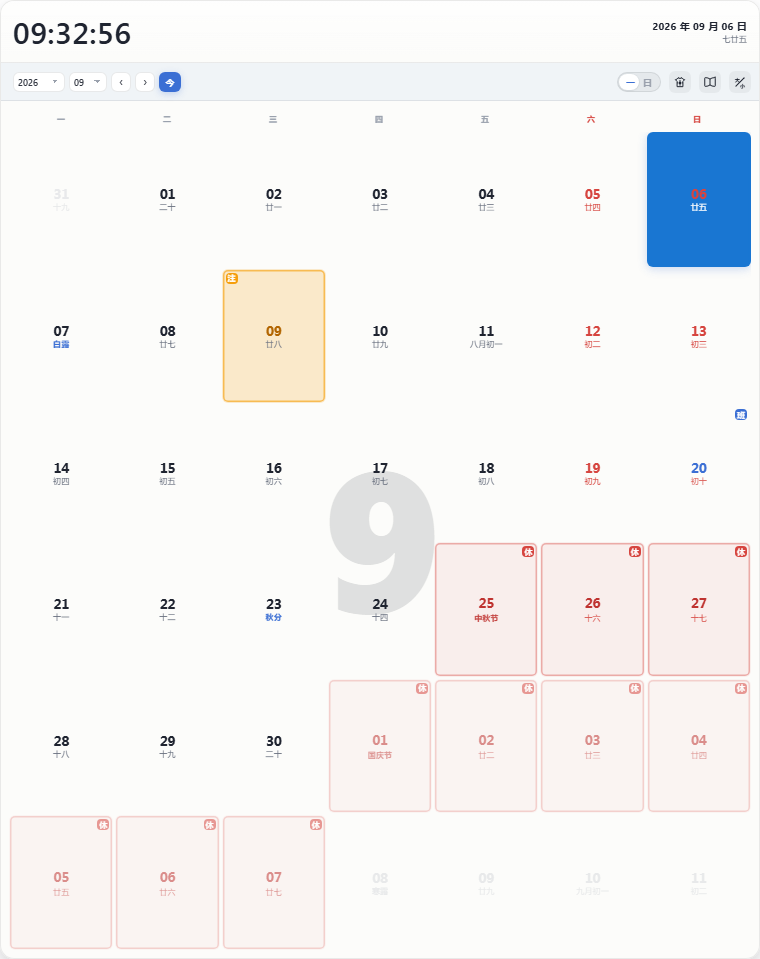
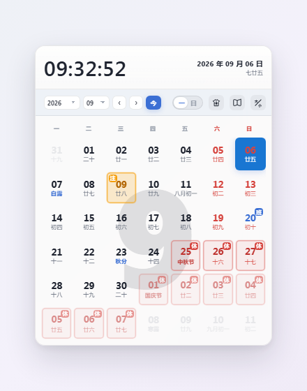

# 简洁桌面日历 · 软件介绍与使用说明书

> 受够了 Windows 原生日历，也实在受不了满屏广告、账号、会员的第三方日历？这款极简桌面日历，**打开就是一张日历**，只做三件事：**看日历、看放假、看上班**，外加一个真正有用的「特别关注」到期提醒。

---

## 一、软件介绍

**简洁桌面日历**是一款 Windows 桌面日历软件。它常驻在任务栏右端显示实时时钟，点击即可唤出一张无边框的漂亮日历，随点随用、点外即隐，不打扰你的桌面。

### 核心特点

- **极简**：无广告、无账号、无云同步、无待办/天气等多余功能。
- **任务栏实时时钟**：任务栏右端常驻「时:分 + 年月日」，像原生时钟一样长在任务栏上，不占任务栏按钮。
- **放假/上班一目了然**：法定节假日标红「休」、调休补班标蓝「班」。
- **农历/节日/节气**：每天副字显示农历、节日或 24 节气。
- **区间算天数**：点两个日期，自动算出「共计 N 天」，支持跨月。
- **特别关注提醒**：重要日期标金黄「注」，到期当天自动弹窗提醒。
- **白日/黑夜双主题**：一键切换，护眼协调。
- **放大模式**：点「⊕」近全屏放大，字号同步变大。

### 界面速览

| 日历主体（白日） | 日历主体（黑夜） |
|---|---|
|  |  |

| 放大模式 | 整体效果 |
|---|---|
|  |  |

### 版本信息

- 当前版本：**v2.0.0**
- 运行平台：Windows 10 / Windows 11
- 协议：[MIT](LICENSE)

---

## 二、安装与启动

### 系统要求

- Windows 10（build 19045+）或 Windows 11
- 无需管理员权限（默认安装到当前用户目录）

### 安装步骤

1. 从 [GitHub Releases](https://github.com/kt87on/simple-desktop-calendar/releases) 下载 `简洁桌面日历 Setup x.x.x.exe`。
2. 双击运行，按向导「下一步 → 完成」。
3. 安装完成后可勾选「立即运行」与「查看说明文档」。

> 默认会创建**桌面快捷方式**和**开始菜单快捷方式**，并设置为**开机自启**。

### 卸载

控制面板 → 程序和功能 → 简洁桌面日历 → 卸载；或点开始菜单里的「卸载简洁桌面日历」。

---

## 三、界面说明

日历主体从上到下分几个区域：

1. **信息条**：左侧大号实时时钟，右侧日期 + 农历。
2. **功能栏**：年/月下拉选择、「‹ ›」翻月、「今」回到今天、「一/日」周起始切换、主题按钮、「⊕」放大。
3. **日历网格**：7 列日期，每格显示阳历数字 + 农历/节日副字。

---

## 四、功能使用说明

### 4.1 打开 / 隐藏日历

- **打开**：左键点击任务栏右端的时钟挂件条。
- **隐藏**：点击日历界面外的任意空白处，日历自动隐藏。

### 4.2 任务栏挂件条

任务栏右端的实时时钟（上行「时:分」、下行「年月日」）常驻显示。它有两种形态（右键菜单切换）：

- **桌面插件**（默认）：一个可拖动的小方框，按住可拖到屏幕任意位置（拖不出屏幕、也压不到任务栏），落点会被记住。
- **桌面图标**：收起插件，只在系统托盘留一个静态图标，左键点它切回插件。

> 挂件条右键、或日历主体空白处右键，都能弹出功能菜单（主题 / 置顶 / 开机自启 / 挂件条开关 / 双形态切换 / 退出等）。

### 4.3 翻月 / 回到今天

- 「‹ ›」箭头：上一月 / 下一月。
- 年、月下拉框：直接跳转到任意年/月。
- 「今」按钮：一键回到当前月。

### 4.4 农历 / 节日 / 节气

每格日期下方的小字自动显示：

- **农历日期**（如「廿五」）；
- 或**节日**（如「中秋」），按白名单只保留中国传统与主流民俗节日；
- 或**24 节气**（如「白露」）。

### 4.5 放假 / 上班

- **法定节假日**：朱砂红底 + 红色「休」角标。
- **调休补班**：蓝色「班」角标。

一眼看清哪天休、哪天班。

### 4.6 区间天数计算

1. 点击**第一个日期**，再点击**第二个日期**。
2. 两端变深绿、中间连成浅绿一条带，浮层实时显示「共计 N 天」。
3. 第三次点击、按 `Esc` 或点空白处取消。

> 支持跨月计算（如 9 月 25 日到 10 月 5 日）。

### 4.7 特别关注 / 提醒

1. 右键点击某个日期 → 输入备忘（**15 字以内**）→ 确认。
2. 该格变**金黄底 + 「注」角标**。
3. 到日期当天，自动弹出提醒窗口：
   - 「知道了」：当天不再弹；
   - 「稍后提醒」：30 分钟后再弹。

- 鼠标指向格右上角「注」小标，可快速查看完整内容。
- 点工具栏的书图标，打开**关注列表窗口**批量查看 / 一键取消（该窗口可拖到屏幕任意位置）。
- 最多 **10 条**，每条 **15 字以内**，超出会提示。

### 4.8 每周起始切换

点「一 / 日」开关，选择每周从**周一**还是**周日**开始，习惯你定。

### 4.9 主题（白日 / 黑夜）

点「☾ / ☀」按钮，在**纸白**与**墨黑**两套配色间切换，选择会被记住。

### 4.10 放大模式

- 点「⊕」放大到近全屏，字号、间距同步放大（不是简单拉伸）。
- 放大态拖到屏幕边缘自动吸附；拖拽四角可等比缩放。
- 点界面外任意处退出放大。

### 4.11 退出软件

- 任务栏挂件条右键 → 「退出软件」，或日历主体空白处右键 → 「退出软件」。
- 弹出确认卡片 → 点「退出」才真正退出；点「取消」或按 `Esc` 留在原处。

---

## 五、常见问题（FAQ）

**Q1：任务栏挂件条不见了怎么办？**
A：右键日历主体空白处 → 菜单里可重新打开挂件条；或从「桌面图标」切回「桌面插件」。

**Q2：日历点不出来 / 点别处不消失？**
A：挂件条只有小方框内响应鼠标。请确认点的是方框本体；方框外是故意穿透的。

**Q3：拖挂件条时松手就飞了 / 卡在半空？**
A：拖动受屏幕工作区限制，拖不出屏幕、也压不到任务栏，属正常。若异常，重启软件即恢复默认落点。

**Q4：节假日数据准吗？**
A：节假日为 2026 年国务院办公厅安排（硬编码），每年需更新一次数据。

**Q5：怎么开机不自启？**
A：右键菜单里取消「开机自启」勾选即可。

---

## 六、许可证

[MIT](LICENSE) © 2026 YG
