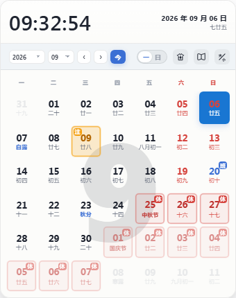
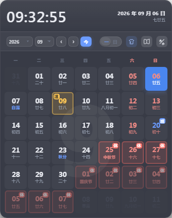

# 简洁桌面日历 · 软件介绍与使用说明

> 受够了 Windows 原生日历，也实在受不了满屏广告、账号、会员的第三方日历？这款极简桌面日历，**打开就是一张日历**，只做三件事：**看日历、看放假、看上班**，外加一个真正有用的「特别关注」到期提醒。

---

## 一、软件介绍

**简洁桌面日历**是一款 Windows 桌面日历软件。它常驻在任务栏右端显示实时时钟，点击即可唤出一张无边框的漂亮日历，随点随用、点外即隐，不打扰你的桌面。

### 核心特点

- **极简**：无广告、无账号、无云同步、无待办/天气等多余功能。
- **任务栏实时时钟**：任务栏右端常驻「时:分:秒 + 星期/日期」，像原生时钟一样长在任务栏上，不占任务栏按钮。
- **放假/上班一目了然**：法定节假日标红「休」、调休补班标蓝「班」。
- **农历/节日/节气**：每天副字显示农历、节日或 24 节气。
- **区间算天数**：点两个日期，自动算出「共计 N 天」，支持跨月。
- **特别关注提醒**：重要日期标金黄「注」，到期当天自动弹窗提醒。
- **桌面插件**：把日历板块作为一块桌面工具摆在桌面上，可拖动、可锁定。
- **白日/黑夜双主题**：一键切换，护眼协调。
- **放大模式**：点放大镜「+」近全屏放大，字号同步变大，放大后可拖动窗口（不越屏幕）。

### 基本信息

| 项目 | 内容 |
|---|---|
| 软件名称 | 简洁桌面日历 |
| 当前版本 | v2.3.2 |
| 安装包大小 | 约 75 MB |
| 安装后占用 | 约 260 MB（含运行组件） |
| 运行平台 | Windows 10 / Windows 11（无需管理员权限） |
| 许可协议 | [MIT](LICENSE)，免费使用 |
| 官方网站 | https://github.com/kt87on/simple-desktop-calendar |

### 界面速览

| 日历主体（白日） | 日历主体（黑夜） |
|---|---|
|  |  |

---

## 二、安装与启动

### 系统要求

- Windows 10 或 Windows 11
- 无需管理员权限（默认安装到当前用户目录）

### 安装步骤

1. 从 [GitHub Releases](https://github.com/kt87on/simple-desktop-calendar/releases) 下载 `简洁桌面日历 Setup x.x.x.exe`。
2. 双击运行，按向导「下一步 → 完成」。
3. 安装完成后可勾选「立即运行」与「查看说明文档」。

> 默认会创建**桌面快捷方式**和**开始菜单快捷方式**，并设置为**开机自启**。

### 卸载

控制面板 → 程序和功能 → 简洁桌面日历 → 卸载；或点开始菜单里的「卸载简洁桌面日历」。

---

## 三、功能说明

### 3.1 任务栏挂件条（浮动时钟）

任务栏右端常驻一个实时时钟（上行「时:分:秒」、下行「星期 月/日」）。用法：

- **点一下**：打开 / 关闭日历主窗口。
- **按住拖动**：移到屏幕任意位置（拖不出屏幕、也压不到任务栏），落点会被记住。
- **右键**：弹出功能菜单（最近节日 / 特别关注 / 显示·隐藏日历 / 设置 / 退出软件）。

它有两种形态（设置里切换）：

- **浮动插件**（默认）：可拖动的小方框，始终可见。
- **托盘图标**：收起插件，只在系统托盘留一个静态图标，左键点它切回插件。

### 3.2 日历主窗口

- 「‹ ›」箭头翻上 / 下月；年、月下拉框直接跳转到任意年/月；「今」一键回到当前月。
- 每格日期下方显示农历、节日或 24 节气。
- 法定节假日红底标「休」，调休补班标「班」。
- 点第一个日期 + 第二个日期，中间连成色带并显示「共计 N 天」，支持跨月。
- 点放大镜「+」放大，可拖动窗口，拖四角可等比缩放。
- 点「☾ / ☀」切换白日 / 黑夜主题。

### 3.3 特别关注 / 提醒

1. 右键点击某个日期 → 输入备忘（**15 字以内**）→ 确认。
2. 该格变**金黄底 + 「注」角标**。
3. 到日期当天，自动弹出提醒窗口：
   - 「知道了」：当天不再弹；
   - 「稍后提醒」：30 分钟后再弹。

- 点工具栏的书图标，打开**关注列表窗口**批量查看 / 一键取消（该窗口可拖到屏幕任意位置）。
- 关注数量不限，每条 15 字以内。

### 3.4 桌面插件

在「设置」中开启「桌面插件」，把**日历板块**（不含顶部时间条）作为一块桌面工具：

- **拖动**：按住移到任意位置（屏幕边框与任务栏为界）。
- **锁定**：点锁定键固定位置，不再被误拖，其余功能照常。

### 3.5 设置

右键菜单 →「设置」打开设置弹窗（可拖动窗口），集中管理：

- **主题**：白日 / 黑夜。
- **窗口行为**：日历窗口置顶、开机自启、挂件条总开关、插件置顶。
- **显示形态**：浮动插件 / 托盘图标。
- **桌面插件**：开关桌面工具。
- **窗口透明度**：分别调节浮动插件、日历、桌面插件的透明度。
- **数据**：手动检查节假日更新。

### 3.6 节假日自动更新

软件联网检查最新放假安排，有新数据自动弹窗确认；更新成功显示明细、失败提示原因。可在设置中随时手动检查。

---

## 四、版本更新信息

| 版本 | 日期 | 说明 |
|---|---|---|
| **v2.3.2** | 2026-09 | 放大/缩小按钮重做为放大镜图标；放大模式窗口可拖动且不越屏幕；工具栏改灰并修复漏白边；年月/时间栏/农历字号加大加粗。 |
| **v2.3.1** | 2026-09 | 白日模式工具栏对比度提升；下月日期单元格清晰度优化。 |
| **v2.3.0** | 2026-09 | 设置窗口支持拖动；解除特别关注数量限制；复查优化 Windows 11 兼容；重做使用说明并修复安装后说明未弹出。 |
| v2.2.0 | 2026-09 | 新增桌面插件与设置弹窗；三档窗口透明度；放大等比缩放；点击开关日历；插件显示秒+星期；打开回当前月。 |
| v2.1.0 | 2026-09 | 节假日年度联网更新；修复日历跨天。 |
| v2.0.0 | 2026-09 | 全套视觉重构；白日/黑夜双主题；退出确认卡片。 |
| 更早 | 2026-08 | 任务栏挂件条、双形态、Win11 兼容适配等。 |

---

## 五、常见问题（FAQ）

**Q1：任务栏挂件条不见了怎么办？**
A：右键日历空白处 →「设置」里重新打开挂件条，或把显示形态切回「插件」。

**Q2：日历点不出来 / 点别处不消失？**
A：挂件条只有小方框内响应鼠标，方框外是故意穿透的，请点方框本体。

**Q3：拖挂件条时松手就飞了 / 卡在半空？**
A：拖动受屏幕工作区限制，属正常；异常时重启软件即恢复默认位置。

**Q4：节假日数据准吗？**
A：节假日来自联网更新的官方安排，每年发布后自动更新，也可手动检查。

**Q5：怎么开机不自启？**
A：右键菜单 →「设置」里取消「开机自启」即可。

---

## 六、许可证

[MIT](LICENSE) © 2026 YG
